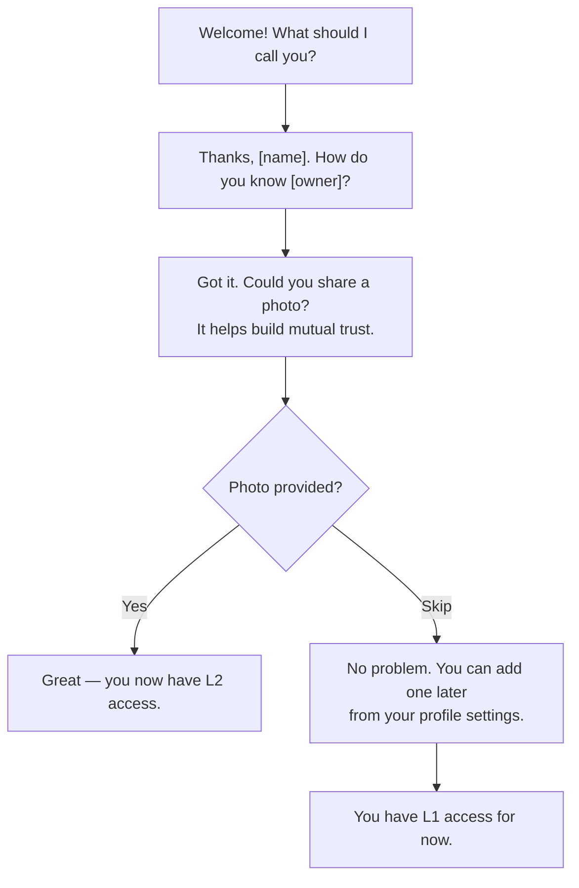

# Inclusive Design

## Overview

BK is built for users who share deeply personal information — disability, identity, health conditions. The interface must be usable by everyone, including those who rely on assistive technologies, have low vision, or face motor or cognitive challenges. This page documents BK's inclusive design principles and their implementation.

---

## High Contrast and Dynamic Text Sizing

BK follows OS-level accessibility settings rather than forcing its own font sizes or contrast modes.

| Setting | iOS | Android | BK Behavior |
|---|---|---|---|
| **Dynamic Type** | Settings > Display > Text Size | Settings > Display > Font Size | All text scales proportionally using relative units |
| **Bold Text** | Settings > Display > Bold Text | Settings > Accessibility > Bold Text | Font weight increases across the app |
| **High Contrast** | Settings > Accessibility > Increase Contrast | Settings > Accessibility > High Contrast | BK switches to a high-contrast color palette |
| **Reduce Motion** | Settings > Accessibility > Reduce Motion | Settings > Accessibility > Remove Animations | Transitions and animations are disabled |

!!! info "Implementation"
    Flutter's `MediaQuery` provides `textScaleFactor` and `boldText`. BK respects these values throughout the widget tree — no hardcoded font sizes.

---

## Haptic Feedback Patterns

BK uses distinct vibration patterns to communicate events through touch, supporting users who may not see or hear notifications.

| Event | Pattern | Description |
|---|---|---|
| **Level-up** | Two short pulses | Confirms trust level has been upgraded |
| **NFC Handshake** | Single long vibration | Smart Handshake NFC tap acknowledged |
| **Urgent Notification** | Three rapid pulses | Time-sensitive alert (e.g., burn-after-reading countdown) |
| **QR Scan Success** | Short-long-short | QR code successfully scanned and processed |
| **Error / Denial** | Two long pulses | Permission denied or action failed |

!!! tip "Custom Haptics"
    On iOS, BK uses `UIImpactFeedbackGenerator` with `.heavy`, `.medium`, and `.light` styles. On Android, it uses `VibrationEffect.createWaveform()` for pattern control.

---

## Symbol Alt Text

BK's symbol system conveys identity and accommodation needs visually. Every symbol includes descriptive alt text for screen readers.

| Symbol | Alt Text |
|---|---|
| :material-rainbow: Rainbow Symbol | "Rainbow Symbol: indicates LGBTQ+ identity" |
| :material-help-circle: Help Mark | "Help Mark: this person may need assistance or accommodations" |
| :material-ear-hearing: Ear Mark | "Ear Mark: indicates hearing-related accommodation needs" |
| :material-hand-wave: Sign Language Mark | "Sign Language Mark: this person uses sign language" |
| :material-baby-carriage: Maternity Mark | "Maternity Mark: indicates expecting or new parent" |

!!! note "Contextual Alt Text"
    When symbols appear in greeting cards or content sections, the alt text is extended with context: "Help Mark displayed on: [content title]."

---

## Form Accessibility

### Audio Guidance for Profile Input

Profile forms provide audio guidance for every input field:

- **Field purpose:** Screen reader announces what the field is for ("Your real name — this will be shared with users at L2 and above")
- **Required indicator:** Required fields are announced as "Required field" before the field label
- **Validation feedback:** Errors are announced immediately ("Error: email address is not valid")
- **Progress tracking:** "Step 2 of 4: Tell us about your relationship to this person"

### Input Assistance

```dart
TextFormField(
  decoration: InputDecoration(
    labelText: 'Real Name',
    hintText: 'Enter your full name',
  ),
  validator: (value) => value!.isEmpty ? 'Name is required' : null,
  autofillHints: [AutofillHints.name],
)
```

!!! info "Semantic Annotations"
    Every form field is wrapped in a `Semantics` widget with `label`, `hint`, and `onTapHint` properties to ensure screen readers provide complete context.

---

## QR Display Accessibility

When BK displays a QR code on screen, the screen reader announces its purpose so visually impaired users know what is being shown:

- **Standard QR:** "Currently displaying QR code for: sharing your profile link"
- **Smart Handshake QR:** "Currently displaying QR code for: Smart Handshake — hold your device near the other person's phone"
- **Greeting QR:** "Currently displaying QR code for: greeting card invitation"
- **Access Link QR:** "Currently displaying QR code for: access link to [content title]"

The announcement includes a prompt: "Ask the other person to scan this code, or tap to copy the link to clipboard."

---

## Conversational Onboarding

BK replaces cold, form-heavy onboarding with a dialogue-style experience that feels like a conversation rather than a bureaucratic process.

### Tone Examples

| Traditional Form | BK Conversational Prompt |
|---|---|
| "Enter your name" | "Nice to meet you! What should I call you?" |
| "Select relationship type" | "How do you know the person who shared this with you?" |
| "Upload a photo" | "Here, I'm sharing something personal. Could you tell me a bit about yourself? A photo helps build trust." |
| "Agree to terms" | "Before we continue, here's how your information will be protected. Take a moment to review." |

### Progressive Disclosure



!!! tip "Why Conversational?"
    Users sharing or receiving sensitive personal information may feel vulnerable. A warm, human tone reduces friction and builds the psychological safety that BK's trust model depends on.

---

## Color Contrast and WCAG Compliance

All BK symbols and UI elements meet **WCAG 2.1 AA** contrast standards (minimum 4.5:1 for normal text, 3:1 for large text).

| Element | Foreground | Background | Contrast Ratio | WCAG |
|---|---|---|---|---|
| Help Mark (red) | `#D32F2F` | `#FFFFFF` | 5.6:1 | :material-check: AA |
| Rainbow Symbol (multi) | Darkest band `#7B1FA2` | `#FFFFFF` | 7.8:1 | :material-check: AAA |
| Body text | `#212121` | `#FFFFFF` | 16.1:1 | :material-check: AAA |
| Secondary text | `#616161` | `#FFFFFF` | 5.9:1 | :material-check: AA |
| Error text | `#C62828` | `#FFFFFF` | 6.5:1 | :material-check: AA |

!!! warning "Dark Mode"
    BK supports dark mode. All contrast ratios are verified for both light and dark themes. Dark mode uses lightened variants of symbol colors to maintain compliance.

---

## Large Tap Targets and Keyboard Navigation

### Mobile: Tap Targets

All interactive elements meet the **48x48 dp minimum** tap target size recommended by Material Design and WCAG 2.5.5:

- Buttons, toggles, and checkboxes: minimum 48x48 dp
- List items and card actions: full-width tap area
- Close/dismiss targets: 48x48 dp with adequate spacing from adjacent elements

### Web: Keyboard Navigation

The BK web client (PWA) supports full keyboard navigation:

| Key | Action |
|---|---|
| `Tab` / `Shift+Tab` | Move focus forward / backward |
| `Enter` / `Space` | Activate focused element |
| `Escape` | Close modals, dismiss overlays |
| `Arrow keys` | Navigate within lists, sliders, and menus |
| `?` | Open keyboard shortcut help overlay |

!!! info "Focus Indicators"
    All focusable elements display a visible focus ring (2px solid outline) that meets WCAG 2.4.7. The focus ring color adapts to the current theme for sufficient contrast.
