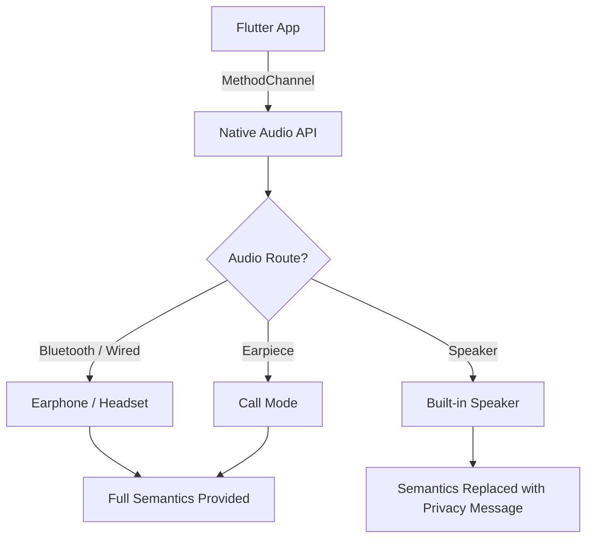

# Secure Audio (TTS)

## Overview

Visually impaired users depend on screen readers such as VoiceOver (iOS) and TalkBack (Android) to navigate BK content. However, when sensitive information — disability status, LGBTQ+ identity, medical conditions — is read aloud through device speakers, it can leak to bystanders. Secure Audio ensures that text-to-speech output for high-sensitivity content is only delivered through private audio channels.

---

## The Problem

Screen readers vocalize every semantic label on screen. In a public setting (office, cafe, train), a user browsing L5+ content could have deeply personal information announced to anyone nearby.

!!! danger "Real-World Risk"
    Imagine a user checking their Help Mark details on a crowded train. Without protection, TalkBack might announce: "Disability: Developmental disorder — requires workplace accommodations." This is an involuntary disclosure to every bystander within earshot.

---

## Solution: Audio Output Destination Monitoring

BK monitors the device's audio output destination in real time and restricts TTS delivery for content flagged at L5 and above.

### Detection Architecture



BK uses a **Flutter MethodChannel** to invoke native platform APIs:

| Platform | API | Detection Method |
|---|---|---|
| **iOS** | `AVAudioSession.currentRoute` | Check `outputs` array for `.headphones`, `.bluetoothA2DP`, `.builtInReceiver` |
| **Android** | `AudioManager.getDevices(GET_DEVICES_OUTPUTS)` | Check device types for `TYPE_WIRED_HEADSET`, `TYPE_BLUETOOTH_A2DP`, `TYPE_BUILTIN_EARPIECE` |

---

## Three Audio States

### State 1: Earphone / Headset Connected

- **Detection:** Wired headphones or Bluetooth audio device detected
- **Behavior:** Full semantic labels are provided to the screen reader
- **User experience:** Normal accessibility — all content is vocalized privately

### State 2: Earpiece / Call Mode

- **Detection:** Phone held to ear (proximity sensor + earpiece route active)
- **Behavior:** Full semantic labels delivered via the earpiece speaker
- **User experience:** Content is audible only to the person holding the device

### State 3: Speaker Output (Default)

- **Detection:** No headphones, no earpiece — audio routed to built-in speaker
- **Behavior:** Sensitive semantic labels are replaced with a privacy prompt
- **User experience:** Screen reader announces the substitute message

!!! warning "Speaker State Behavior"
    When the device is in speaker mode, the screen reader will announce: **"For privacy protection, please connect earphones to hear this content."** The visual content remains displayed normally — only the TTS output is restricted.

---

## Flutter Implementation

### Semantics Widget Integration

```dart
Semantics(
  label: isHeadphonesConnected
      ? sensitiveContent
      : "For privacy protection, please connect earphones",
  child: Text(contentBody),
)
```

### Audio Route Listener

The app registers a listener that fires whenever the audio route changes (e.g., earphones unplugged mid-session):

```dart
AudioRouteChannel.setMethodCallHandler((call) {
  if (call.method == 'onAudioRouteChanged') {
    final route = call.arguments as String;
    setState(() {
      isHeadphonesConnected = route != 'speaker';
    });
  }
});
```

!!! tip "Real-Time Switching"
    If a user unplugs their earphones while viewing L5+ content, the semantic labels are **immediately** replaced. Re-connecting earphones restores full semantics without needing to reload the page.

---

## Rails API Integration

### Content Flag

The API includes an `audio_protection_required` flag on content responses:

```json
{
  "content_id": "abc-123",
  "trust_level": 5,
  "audio_protection_required": true,
  "body_encrypted": "...",
  "format": "markdown"
}
```

| Field | Type | Description |
|---|---|---|
| `audio_protection_required` | `boolean` | When `true`, the Flutter client must check audio route before providing semantic labels |

### Server-Side Logic

The flag is automatically set to `true` for:

- All content at **L5 and above**
- Any content where the admin has manually enabled earphone-only TTS

---

## BKC Admin Setting

In the BK Command Center, content editors can toggle **"Earphone-only TTS"** on a per-content basis:

- Located in the content editor's **Security Toggles** panel
- Overrides the default level-based rule (e.g., force earphone-only on an L3 item that contains sensitive context)
- The toggle sets `audio_protection_required: true` on the content record

!!! note "Default Behavior"
    Content at L5+ has earphone-only TTS enabled by default. The admin toggle allows enabling it for lower-level content or disabling it for specific L5+ items where audio privacy is not a concern.

---

## Audio State Summary

| Audio Route | L0–L4 Content | L5+ Content (or flagged) |
|---|---|---|
| :material-headphones: Headphones / Bluetooth | Full semantics | Full semantics |
| :material-phone: Earpiece (call mode) | Full semantics | Full semantics |
| :material-volume-high: Speaker | Full semantics | Privacy message only |
