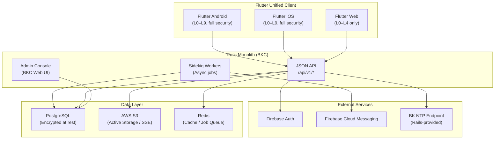

# System Overview

## High-Level Architecture

Bokunokoto adopts a **Rails monolith + Flutter unified client** architecture, optimized for low development cost, security, and maintainability.



## Deployment Model

BK operates as a **rental-base SaaS** (multi-tenant monolith). A single Rails application serves multiple "Disclosers" (vault owners), each with fully isolated data.

| Component | Hosting | Notes |
|---|---|---|
| Rails API + BKC | Heroku / Render | Monolith deployment with Sidekiq |
| PostgreSQL | Heroku Postgres / RDS | Active Record Encryption enabled |
| Object Storage | AWS S3 | Face snapshots, greeting card assets |
| Flutter Web | Firebase Hosting | Low-permission client (L0–L4) |
| Flutter App | Firebase App Distribution (Beta) → App Store / Google Play (Release) | Full-permission client (L0–L9) |

## Multi-Tenant Isolation

Every piece of data is scoped to a **Vault** (one per user). Rails controllers enforce vault-level scoping via `current_user.my_vault`, preventing cross-tenant data leakage.

```ruby
# All queries go through the user's vault
@contents = current_user.my_vault.contents.accessible_for(viewer, platform)
```

## Dual-Mode Client

The Flutter app operates in two modes, switchable within a single binary:

| Mode | Role | Capabilities |
|---|---|---|
| **Admin** | Manage your own Vault | Edit content, issue QR codes, monitor audit logs, send greetings |
| **Viewer** | View someone else's Vault | Browse permitted content, submit questions, receive notifications |

## Feature Flags

New features (NFC, eKYC, etc.) are gated behind Feature Flags managed in the Rails backend. This allows staged rollout, A/B testing, and emergency kill-switches without app updates.

```ruby
class User < ApplicationRecord
  def feature_enabled?(feature_name)
    FeatureFlags.enabled?(feature_name, self)
  end
end
```
