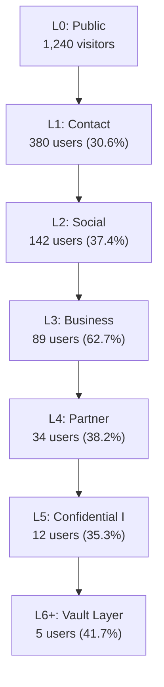
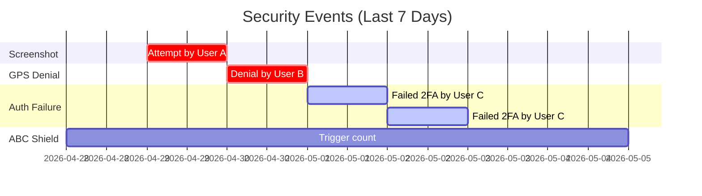
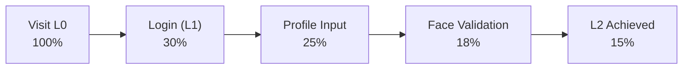

# Analytics Dashboard

## Overview

The BK Analytics Dashboard is available from **beta launch (day 1)** within BKC. It provides vault owners with data-driven insights into how their content is accessed, how trust relationships evolve, and where security events occur. Analytics inform pricing decisions, feature flag management, and UX improvements.

---

## Visualization Stack

| Layer | Technology | Notes |
|---|---|---|
| **Charts** | Chart.js | Lightweight, interactive charts for standard metrics |
| **Complex visualizations** | D3.js | Custom visualizations for trust flow and network graphs |
| **Dashboard framework** | Rails + Hotwire (Turbo Frames) | Each dashboard card is a lazy-loaded Turbo Frame |
| **Data aggregation** | PostgreSQL materialized views + Sidekiq | Pre-computed daily/weekly/monthly rollups |

---

## Trust Transition Analysis

Track how viewers progress through trust levels over time.

### Metrics

| Metric | Description |
|---|---|
| **Time between upgrades** | Average duration from Ln to Ln+1 |
| **Conversion funnel** | Drop-off rates at each trust level transition |
| **Upgrade velocity** | How quickly new users reach L2, L3, L5 |
| **Downgrade frequency** | How often and why users are downgraded |

### Trust Funnel Visualization

!!! info "Profile Completion Funnel"
    The L0 to L1 conversion (login) and L1 to L2 conversion (profile + face) are critical onboarding metrics. Low conversion rates here indicate friction in the onboarding UX.

---

## Access Link Attribution

Understand which distribution channels drive the most engagement.

| Metric | Description |
|---|---|
| **QR scans by source** | Which physical QR codes (business card, poster, event badge) are scanned most |
| **Link clicks by channel** | Email, SMS, SNS, direct URL — which drives traffic |
| **Conversion by source** | Which link/QR source produces the highest L0 to L2 conversion |
| **Geographic distribution** | Where access links are being used (city-level) |

### Attribution Table

| Source | Impressions | Clicks | L1 Conversions | L2 Conversions | Conversion Rate |
|---|---|---|---|---|---|
| Business card QR | — | 89 | 42 | 18 | 20.2% |
| Email invitation | 200 | 124 | 98 | 67 | 33.5% |
| SNS link | — | 312 | 45 | 12 | 3.8% |
| Event NFC handshake | — | 23 | 23 | 19 | 82.6% |

!!! tip "NFC Handshake Wins"
    In-person NFC handshakes consistently show the highest conversion rates because mutual trust is established face-to-face before the digital interaction begins.

---

## Content Engagement

Detailed metrics for each content piece in the vault.

| Metric | Description |
|---|---|
| **View duration** | Average time spent on the content |
| **Scroll depth** | How far down the page viewers scroll (25%, 50%, 75%, 100%) |
| **Repeat visits** | Number of return views per user per content piece |
| **Unique viewers** | Distinct users who have viewed the content |
| **Engagement score** | Composite score: duration x depth x repeat factor |

### Content Heatmap

The dashboard includes a heatmap showing which content pieces receive the most engagement at each trust level, helping vault owners understand what viewers care about most.

---

## Security Events

Real-time monitoring of security-related incidents.

| Event | Description | Severity |
|---|---|---|
| **Screenshot attempt** | Native app detected a screenshot or screen recording attempt | :material-alert: High |
| **GPS denial** | Viewer denied GPS permission on L7+ content | :material-alert: High |
| **Camera denial** | Viewer denied camera permission on L7+ content | :material-alert: High |
| **Authentication failure** | Failed login or 2FA attempt | :material-alert-circle: Medium |
| **ABC Shield trigger** | Blackout overlay activated (app backgrounded, etc.) | :material-information: Low |
| **Watermark generation** | Dynamic watermark was rendered for a viewer | :material-information: Low |

### Security Event Timeline

---

## Accessibility Metrics

Track how accessibility features are being used.

| Metric | Description |
|---|---|
| **Earphone connection rate** | Percentage of L5+ content views where earphones were connected |
| **TTS usage** | How often screen reader semantics are consumed (VoiceOver/TalkBack active) |
| **Privacy message frequency** | How often the "please connect earphones" message is triggered |
| **High contrast mode** | Percentage of sessions using OS high contrast settings |
| **Dynamic text scaling** | Distribution of text scale factors across sessions |

!!! note "Privacy-First Analytics"
    Accessibility metrics are aggregated and anonymized. BK never stores which specific users use assistive technologies — only aggregate counts and rates.

---

## Greeting Metrics

Performance data for the Greeting Engine.

| Metric | Description |
|---|---|
| **Preload completion rate** | Percentage of greeting cards successfully preloaded to devices |
| **Open rate after time-lock** | Percentage of preloaded cards opened after the unlock time |
| **Time-to-open** | Average time between unlock moment and first view |
| **Delivery failure rate** | Percentage of cards that failed to deliver (FCM issues, offline devices) |
| **Variable resolution rate** | Percentage of template variables successfully resolved |

---

## Profile Completion Funnel

Detailed conversion tracking through the onboarding flow.

| Step | Conversion | Drop-off Reason |
|---|---|---|
| Visit to Login | ~30% | Casual visitors, no intent to engage |
| Login to Profile | ~83% | Profile form feels invasive; improve conversational onboarding |
| Profile to Face | ~72% | Camera permission denial; unclear why face is needed |
| Face to L2 | ~83% | Face validation failures (lighting, angle) |

---

## Data-Driven Decisions

Analytics data directly informs three key areas:

### 1. Pricing Model (1-Year Plan)

- Content engagement data reveals which features users value most
- Trust funnel conversion rates indicate willingness to invest in the platform
- Greeting delivery volumes inform tier pricing for batch features

### 2. Feature Flag Decisions

- Feature adoption metrics determine whether to graduate, iterate, or retire features
- A/B test results from flagged features feed directly into the analytics dashboard
- Security event trends influence which security features to enable by default

### 3. UX Improvements

- Profile completion funnel identifies onboarding friction points
- Content engagement heatmaps reveal underperforming content layouts
- Accessibility metrics guide investment in assistive technology support

!!! info "Dashboard Access"
    The Analytics Dashboard is accessible within BKC under **BK Observer > Analytics**. All data is scoped to the vault owner's own vault — no cross-vault analytics exist.
