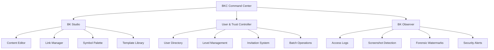
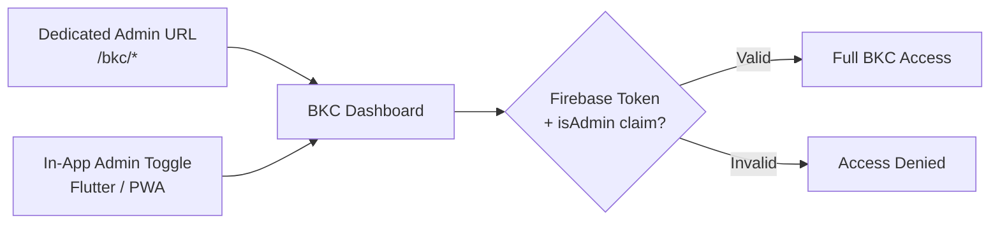

# BKC Command Center Overview

## Overview

**BKC** (Bokunokoto Command Center) is the admin backbone of the BK platform. Every registered user gets their own BKC instance for managing their personal vault — content, trust levels, viewer permissions, security settings, and analytics. BKC is where vault owners maintain full control over who sees what and under what conditions.

---

## Tech Stack

| Layer | Technology | Notes |
|---|---|---|
| **Backend** | Ruby on Rails | API and admin server |
| **Frontend** | Hotwire (Turbo + Stimulus) | SPA-like experience without heavy JS frameworks |
| **Components** | ViewComponent | Reusable, testable UI components |
| **Real-time** | Turbo Streams + ActionCable | Live updates for audit logs, notifications |
| **Mobile Admin** | Flutter (Admin mode) | On-the-go management mirroring BKC functionality |

!!! info "Why Hotwire?"
    BKC prioritizes server-rendered HTML with progressive enhancement. Hotwire provides fast, interactive admin UIs without the complexity of a separate SPA frontend. ViewComponent keeps the admin UI modular and testable.

---

## Three Main Sections



### 1. BK Studio

The content and link management hub:

- **Content Editor** — Create and edit vault content in Markdown, HTML, or drag-and-drop mode (see [Content Editor](content-editor.md))
- **Link Manager** — Generate and manage dynamic access links and QR codes
- **Symbol Palette** — Configure which symbols (Help Mark, Rainbow, Ear Mark, etc.) are active and at which trust levels
- **Template Library** — Pre-built and custom templates for common disclosure scenarios

### 2. User & Trust Controller

Viewer and permission management:

- **User Directory** — Browse all users who have accessed the vault
- **Level Management** — Adjust trust levels (L0-L9) per user with one action
- **Invitation System** — Create and send email invitations with preset access levels
- **Batch Operations** — Select multiple users for bulk level changes

See [User & Trust Controller](user-trust-controller.md) for full details.

### 3. BK Observer

Forensic monitoring and security intelligence:

- **Access Logs** — Complete audit trail of every content view, with timestamps, device info, and location
- **Screenshot Detection** — Alerts when screenshot attempts are detected on native apps
- **Forensic Watermarks** — Track leaked content back to the viewer who captured it
- **Security Alerts** — Real-time notifications for suspicious activity (GPS spoofing, repeated auth failures)

---

## Additional Modules

### Greeting Center

Manage greeting cards, batch imports, time-locked delivery, and delivery tracking. See [Greeting Engine](../features/greeting-engine.md).

### Feature Flag Management

Control feature rollouts and A/B tests:

- Toggle features per user, per trust level, or globally
- Schedule feature activation/deactivation
- Monitor feature adoption metrics

### Analytics Dashboard

Track engagement, security events, and trust progression. See [Analytics Dashboard](analytics.md).

---

## Mobile Admin: Flutter Admin Mode

The BK Flutter app includes an **Admin mode** that mirrors BKC functionality for on-the-go management.

| Feature | Web BKC | Mobile Admin |
|---|---|---|
| Content editing | Full editor (Markdown/HTML/Builder) | Simplified editor for quick edits |
| User management | Complete directory and controls | Quick level-up via QR scan |
| Analytics | Full dashboard with charts | Summary cards and key metrics |
| Audit logs | Full searchable log | Recent activity feed |
| Greeting management | Full builder and scheduler | Quick send and status check |

!!! tip "QR-to-Admin Shortcut"
    In mobile Admin mode, scanning a viewer's QR code immediately opens their profile with a quick level-up button — useful for in-person trust upgrades at events or meetings.

---

## Security

### Authentication Requirements

| Action | Minimum Requirement |
|---|---|
| View BKC dashboard | L9 (vault owner) |
| Edit content | L9 + active session |
| Change trust levels | L9 + FIDO2 or 2FA confirmation |
| View audit logs | L9 + FIDO2 or 2FA confirmation |
| Delete content | L9 + FIDO2 re-authentication |

### Firebase Custom Claims

Admin access is enforced via Firebase Custom Claims:

```json
{
  "uid": "user-abc-123",
  "isAdmin": true,
  "vaultId": "vault-xyz-789"
}
```

The `isAdmin: true` claim is set during vault creation and verified on every BKC request. Rails middleware validates the Firebase ID token and checks for the admin claim before processing any BKC route.

!!! danger "No Shared Admin Access"
    BKC is strictly single-owner. There is no shared admin, delegate, or team access. The vault owner is the sole administrator. This is a deliberate design decision — BK content is too personal for delegated control.

---

## Dual Entry Points

Users can access BKC through two paths:



1. **Dedicated admin routes** — Direct URL access at `/bkc/*` paths (web browser)
2. **In-app Admin mode toggle** — Switch from viewer mode to admin mode within the Flutter app or PWA

Both entry points share the same authentication and authorization pipeline.
