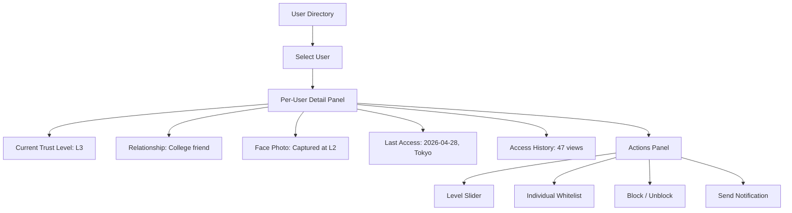
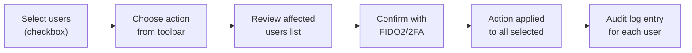
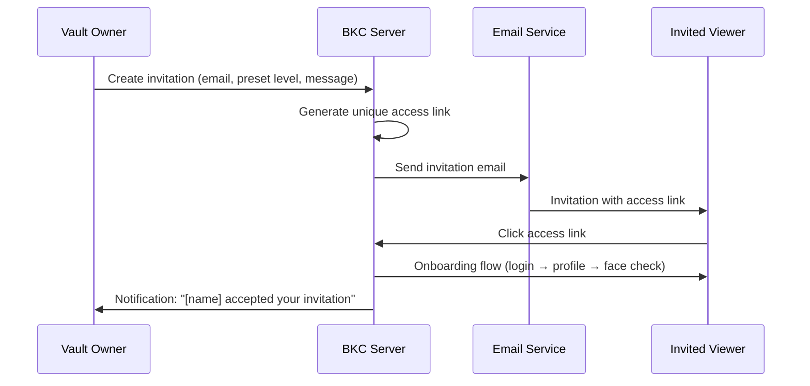
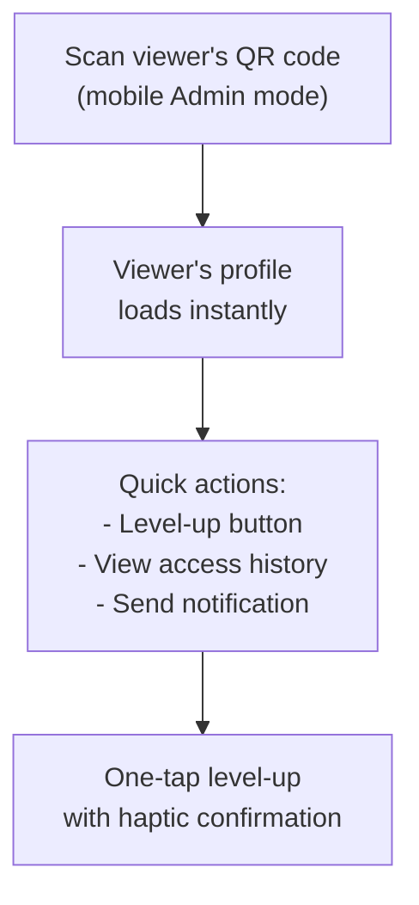

# User & Trust Controller

## Overview

The User & Trust Controller is the permission management hub within BKC. It provides vault owners with a complete view of every person who has accessed their vault and gives them fine-grained control over trust levels, content access, and invitations.

---

## User Directory

The directory lists every viewer who has interacted with the vault, sorted by last access time.

### Directory Columns

| Column | Description |
|---|---|
| **Avatar** | Face photo captured during L2 verification (or profile photo) |
| **Name** | Real name or alias (depending on what the viewer provided) |
| **Trust Level** | Current level (L0-L9) displayed as a badge |
| **Relationship** | Context provided during onboarding ("colleague", "friend", "counselor") |
| **Last Access** | Timestamp and approximate location of most recent access |
| **Status** | Active, Blocked, or Pending invitation |

### Filtering and Search

- **Filter by level:** Show only users at a specific trust level
- **Filter by status:** Active, Blocked, Pending
- **Search:** By name, email, or UID
- **Sort:** By last access, trust level, or name

---

## Per-User View

Selecting a user opens their detailed profile panel:

### Detail Fields

| Field | Description |
|---|---|
| **Face photo** | Photo captured during L2 face validation |
| **Trust level** | Current level with upgrade/downgrade history |
| **Relationship context** | Self-reported relationship to the vault owner |
| **First access** | When the user first visited the vault |
| **Last access** | Most recent visit — timestamp, device type, and approximate location |
| **Total views** | Number of content views across all levels |
| **Content accessed** | List of content IDs the user has viewed |

---

## Level Slider

The level slider allows vault owners to change a user's trust level with a single action.

### How It Works

1. Open the per-user detail panel
2. Drag the level slider from the current level to the desired level (L0-L9)
3. Confirm the change (FIDO2/2FA required for changes to L5+)
4. The change takes effect immediately

!!! warning "Downgrade Behavior"
    Downgrading a user's trust level immediately revokes access to content above the new level. If the user is currently viewing restricted content, the ABC Shield activates on their next API call.

### Level Change Rules

| Action | Confirmation Required | Notes |
|---|---|---|
| Upgrade L0-L4 | Simple confirm dialog | Low-risk levels |
| Upgrade to L5+ | FIDO2 or 2FA | Entering sensitive content territory |
| Downgrade any level | Simple confirm dialog | Immediate access revocation |
| Set to L0 (reset) | Double confirmation | Effectively removes all access |
| Block user | FIDO2 or 2FA | Permanent access denial; sets `is_blocked: true` |

---

## Individual Whitelist

The whitelist allows vault owners to grant access to specific content IDs regardless of the user's trust level.

### Use Cases

- Share a single L7 document with an L3 user (e.g., a doctor who needs specific medical info)
- Grant temporary access to a content piece for a meeting
- Allow access to a greeting card template before the user reaches the required level

### Whitelist Entry

| Field | Description |
|---|---|
| `user_id` | The viewer being granted access |
| `content_id` | The specific content item |
| `granted_at` | Timestamp of the grant |
| `expires_at` | Optional expiration (null = permanent) |
| `reason` | Admin's note for why access was granted |

!!! note "Security Guards Still Apply"
    Whitelisted access bypasses the trust level check, but all other security guards remain active. If the content requires camera/GPS verification, the whitelisted user must still comply.

---

## Batch Operations

Select multiple users from the directory for bulk actions:

| Operation | Description |
|---|---|
| **Batch level change** | Set all selected users to a specific trust level |
| **Batch block** | Block all selected users |
| **Batch unblock** | Restore access for all selected users |
| **Batch notification** | Send a custom notification to all selected users |
| **Export** | Download selected user data as CSV |

### Batch Flow

---

## Invitation Management

Vault owners can invite new viewers by creating and sending email invitations.

### Invitation Flow

### Invitation Settings

| Setting | Description |
|---|---|
| **Recipient email** | Email address of the person to invite |
| **Preset level** | Trust level to assign upon completion of onboarding (default: L1) |
| **Custom message** | Personal message included in the invitation email |
| **Expiration** | How long the invitation link remains valid (default: 7 days) |
| **Auto-approve** | Skip manual approval up to the preset level |

---

## QR Scan Integration

In mobile Admin mode, vault owners can scan a viewer's QR code for instant profile lookup and quick level management.

### QR-to-Profile Flow

!!! tip "In-Person Trust Building"
    The QR scan integration is designed for face-to-face interactions. At a meeting or event, the vault owner can scan a viewer's QR, verify their identity in person, and instantly upgrade their trust level — all in a few seconds.

---

## Special Access Badge

When a user receives individual whitelist access to specific content, they see a **"Special Access"** badge on that content item in their viewer interface.

- Badge appears as a distinct icon next to the content title
- Screen reader announces: "You have been granted special access to this content"
- The badge is visible only to the individually-permitted user

---

## Audit Trail

Every permission change is logged in the BK Observer audit trail:

| Event | Logged Data |
|---|---|
| Level change | Old level, new level, timestamp, admin action type |
| Whitelist grant | Content ID, user ID, expiration, reason |
| Whitelist revoke | Content ID, user ID, revocation timestamp |
| User blocked | User ID, timestamp, blocking reason |
| User unblocked | User ID, timestamp |
| Invitation created | Recipient email, preset level, expiration |
| Invitation accepted | User ID, timestamp, resulting trust level |
| Batch operation | Operation type, affected user IDs, timestamp |

!!! danger "Immutable Log"
    Audit trail entries cannot be edited or deleted, even by the vault owner. This ensures forensic integrity for all permission decisions.
