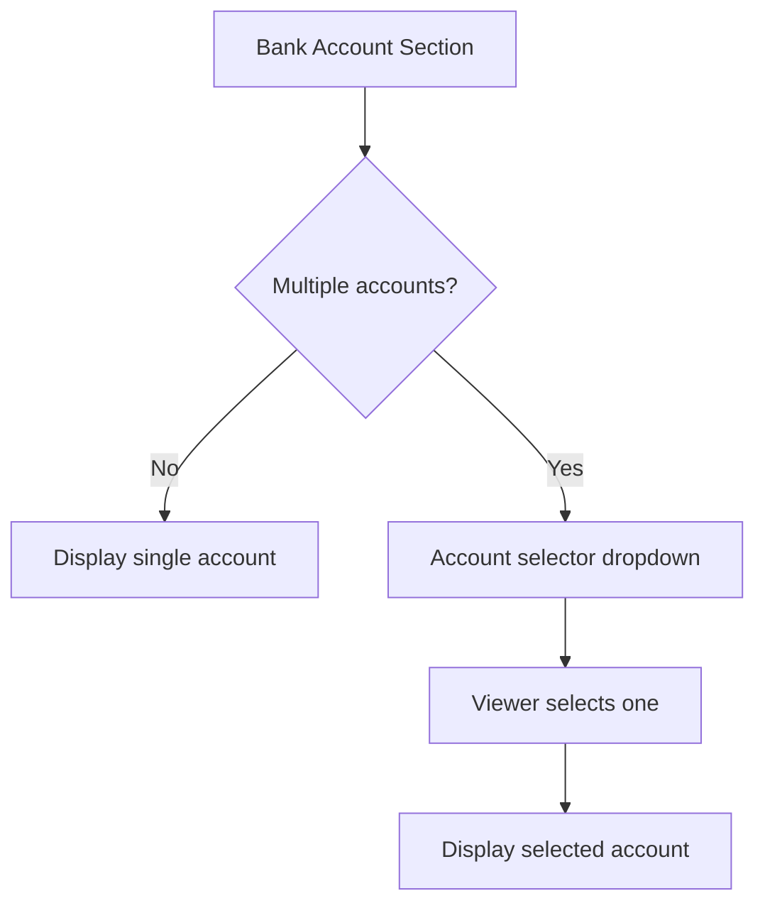

# Bank Account Display

## Overview

The Bank Account Display feature allows the vault owner to share bank account details for payment purposes with authenticated users. Designed for freelancers, creators, and small business operators who need to share payment information without exposing it publicly, this feature balances usability with sensible security defaults.

---

## Access Control

| Requirement | Details |
|---|---|
| **Minimum trust level** | L1 (any authenticated user) |
| **Authentication** | Firebase Auth login required |
| **Visibility** | Available to all logged-in users by default; vault owner can raise the minimum level |

!!! info "Why L1?"
    Bank account numbers are semi-public information in many business contexts (invoices, contracts). The primary goal is to prevent anonymous scraping, not to restrict access to a small circle. Vault owners who want stricter control can raise the minimum level to L3+ in the BKC settings.

---

## Display Behavior

### Masked View (Default)

When the bank account section loads, the account number is displayed with middle digits masked:

```
Bank: Mizuho Bank, Shibuya Branch (210)
Type: Ordinary (普通)
Number: 012-****-5678
Holder: クサマ アキラ
```

The masking pattern preserves the first 3 and last 4 digits, replacing the middle with `****`.

### Reveal Toggle

A "Show full number" button allows the viewer to temporarily reveal the complete account number:

1. Viewer clicks :material-eye: **Show full number**
2. Full number is displayed: `012-3456-5678`
3. After 30 seconds (configurable), the number automatically re-masks
4. Viewer can click :material-eye-off: **Hide** to re-mask immediately

!!! warning "No Persistent Display"
    The full account number is never rendered in the DOM as persistent plain text. It is held in JavaScript memory and injected into a `<span>` only while the reveal toggle is active. On re-mask, the DOM element's `textContent` is overwritten with the masked version.

---

## Copy Button

A dedicated copy button uses the Clipboard API to copy the full account number:

```javascript
async function copyAccountNumber() {
  const fullNumber = getAccountFromMemory(); // Not from DOM
  await navigator.clipboard.writeText(fullNumber);
  showToast("Account number copied to clipboard");
}
```

| Behavior | Details |
|---|---|
| **API** | `navigator.clipboard.writeText()` |
| **Source** | JavaScript variable in memory (not DOM scraping) |
| **Feedback** | Toast notification: "Account number copied" |
| **Fallback** | `document.execCommand('copy')` for older browsers |

---

## Security Approach

### What Is Protected

| Measure | Implementation |
|---|---|
| **No plain text in DOM** | Account number stored in JS variable; injected only on reveal |
| **Authentication required** | L1+ login enforced; anonymous viewers see nothing |
| **Audit logging** | Every reveal and copy action is logged with viewer UID + timestamp |
| **Auto-re-mask** | Full number auto-hides after configurable timeout (default: 30s) |
| **API-level masking** | The Rails API returns masked numbers by default; full number requires a separate authenticated endpoint |

### What Is NOT Protected

!!! note "Usability over DRM"
    The Bank Account Display intentionally does **not** apply:

    - ABC Shield (no video stream rendering)
    - Screenshot prevention
    - Copy/paste blocking

    This is a deliberate design choice. Bank account numbers are routinely shared on invoices and contracts. Applying DRM-level protection would harm usability (e.g., users unable to paste the number into a bank transfer form) without meaningful security gain.

---

## Multiple Account Selection

If the vault owner has registered multiple bank accounts, the viewer sees a selection interface:



### Account Selector

| Field | Description |
|---|---|
| `label` | User-defined name (e.g., "Business Account", "Personal") |
| `bank_name` | Bank and branch name |
| `masked_number` | Masked account number for preview |

!!! tip "Admin Configuration"
    The vault owner can mark one account as **default** and optionally hide others. The "Show all accounts" toggle is available in BKC under the Bank Account settings.

---

## Data Model

```
BankAccount
├── id: bigint (PK)
├── vault_id: FK → Vault
├── bank_name: string
├── branch_name: string
├── branch_code: string
├── account_type: enum (ordinary, checking, savings)
├── account_number: string (encrypted)
├── holder_name: string (encrypted)
├── label: string
├── is_default: boolean
├── display_level: integer (default: 1)
├── created_at: datetime
└── updated_at: datetime
```

!!! warning "Encryption"
    `account_number` and `holder_name` are encrypted at rest using Rails' `encrypts` (Active Record Encryption). The decrypted value is only returned via the authenticated full-number API endpoint.
