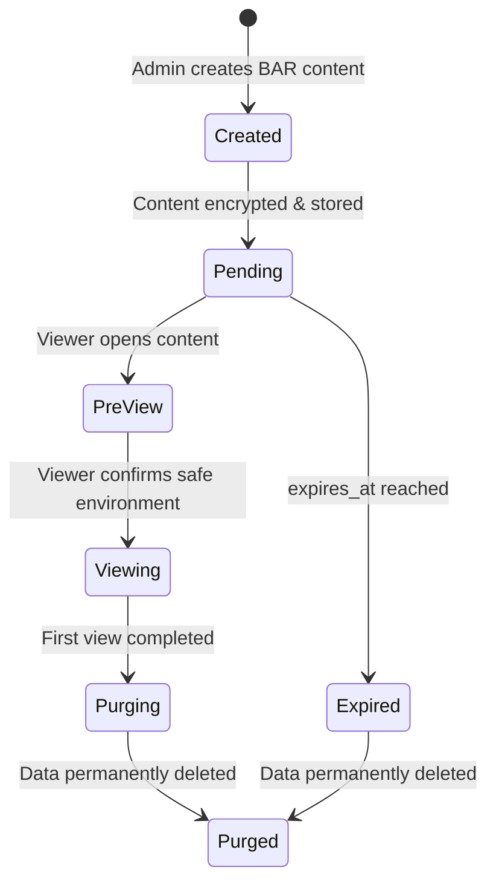
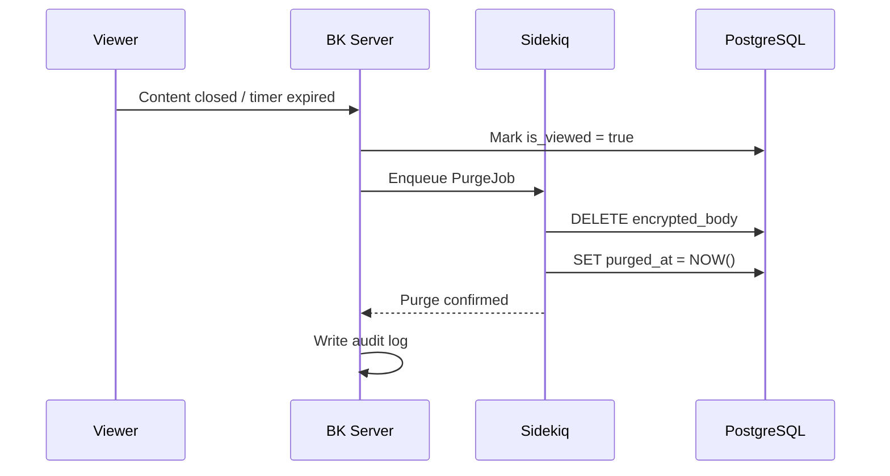
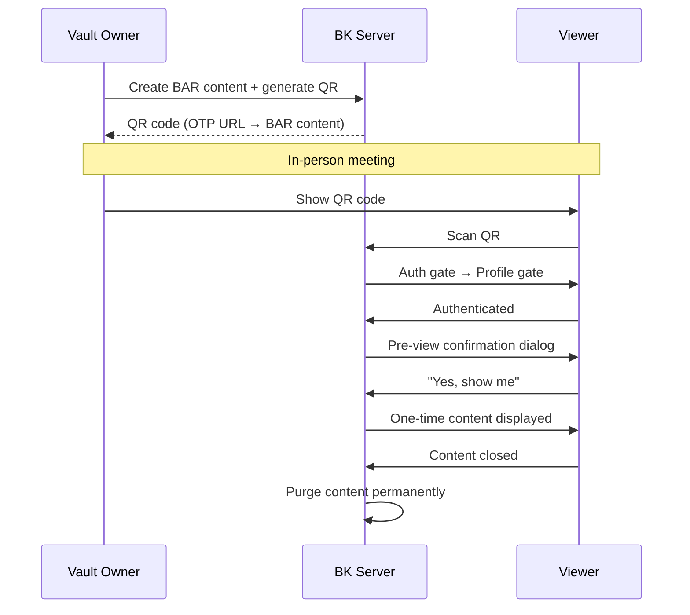

# Burn-After-Reading

## Overview

Burn-After-Reading (BAR) is a one-time viewing mechanism for the most sensitive disclosures. Content marked as BAR can only be viewed once — after the first viewing, it is permanently and irreversibly deleted from the system. This is designed for information that must be communicated but should not persist (e.g., one-time medical instructions, temporary access codes, crisis-specific disclosures).

---

## Lifecycle



---

## Data Model

BAR content is stored in a dedicated table or flagged on the existing Content model:

### Option A: Dedicated Table

```
ephemeral_disclosures
├── id: bigint (PK)
├── vault_id: FK → Vault
├── encrypted_body: binary
├── recipient_uid: string (FK → User.firebase_uid)
├── is_viewed: boolean (default: false)
├── viewed_at: datetime (nullable)
├── expires_at: datetime
├── created_at: datetime
└── purged_at: datetime (nullable)
```

### Option B: Flag on Content Model

```
Content
├── ...existing columns...
├── is_burn_after_reading: boolean (default: false)
├── bar_viewed_at: datetime (nullable)
├── bar_expires_at: datetime (nullable)
└── bar_purged_at: datetime (nullable)
```

!!! note "Recommended Approach"
    Option A (dedicated table) is preferred for clean separation of concerns and simpler purge logic. The `ephemeral_disclosures` table can be on a separate database partition for independent retention policies.

---

## Atomic View Check

The core safety mechanism is an **atomic transaction** that prevents double-viewing:

```ruby
# Rails controller / Cloud Function
def view_ephemeral(disclosure_id, viewer_uid)
  EphemeralDisclosure.transaction do
    disclosure = EphemeralDisclosure
      .lock("FOR UPDATE")  # Row-level lock
      .find(disclosure_id)

    raise AlreadyViewedError if disclosure.is_viewed?
    raise ExpiredError if disclosure.expired?
    raise UnauthorizedError unless disclosure.recipient_uid == viewer_uid

    disclosure.update!(
      is_viewed: true,
      viewed_at: Time.current
    )

    # Return decrypted content for one-time rendering
    disclosure.decrypt_body
  end
end
```

!!! warning "Race Condition Prevention"
    The `FOR UPDATE` row lock ensures that even if two requests arrive simultaneously, only one can proceed. The second request will see `is_viewed: true` and be rejected.

---

## Viewing Flow

### Step 1: Pre-View Confirmation

Before any content is displayed, the viewer sees a confirmation dialog:

> :material-alert-circle: **This information can only be displayed once.**
>
> After viewing, this content will be permanently deleted and cannot be recovered.
>
> Are you in a safe environment where no one can see your screen?
>
> [ Cancel ] [ Yes, show me ]

### Step 2: Active Viewing

During viewing, the following protections are enforced:

| Protection | Description |
|---|---|
| **One-time indicator** | :material-fire: "One-time viewing" banner displayed prominently |
| **ABC Shield** | Full ABC Shield (Layer A + B + C) is **forced on** |
| **Timer** | Optional auto-close timer (configurable, default: no limit) |
| **No navigation** | Back button and link clicks are intercepted with a warning |
| **Watermark** | Dynamic watermark with viewer UID + timestamp |

### Step 3: Post-View Purge

After the viewer closes the content (or the timer expires):



1. The `encrypted_body` column is overwritten with `NULL` (not just soft-deleted)
2. `purged_at` timestamp is recorded
3. An audit log entry is created: `{ event: "bar_purged", disclosure_id, viewer_uid, viewed_at, purged_at }`
4. The record shell is retained for audit trail but contains no recoverable content

---

## Expiration

BAR content auto-expires even if never viewed:

- **`expires_at`** is set at creation time (configurable; default: 24 hours)
- A Sidekiq scheduled job (`BarExpirationJob`) runs every 5 minutes to purge expired content
- Expired content follows the same purge flow as viewed content
- The vault owner is notified if content expires without being viewed

!!! tip "Expiration Recommendation"
    For in-person BAR disclosures (combined with QR), set expiration to 1 hour. For remote delivery, 24–72 hours is typical.

---

## Combined with QR (In-Person BAR)

BAR integrates with Smart Handshake for in-person one-time disclosures:



!!! example "Use Case"
    A doctor shares a one-time access code for medical records. The patient scans the QR in the consultation room, views the code, and the code is permanently deleted. No digital copy remains in BK.

---

## Security Summary

| Aspect | Implementation |
|---|---|
| **Storage** | AES-256 encrypted at rest; decrypted only in-memory during view |
| **Access control** | Bound to single `recipient_uid`; no sharing possible |
| **View atomicity** | PostgreSQL `FOR UPDATE` row lock |
| **Screen protection** | Full ABC Shield enforced (no opt-out) |
| **Data purge** | `encrypted_body` set to NULL; not recoverable |
| **Audit trail** | Record shell retained with timestamps; no content |
| **Expiration** | Auto-purge via Sidekiq cron job |
