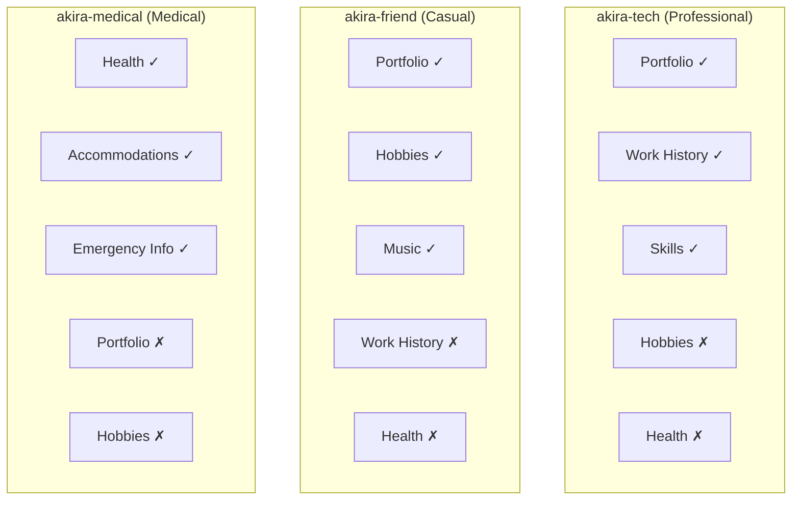
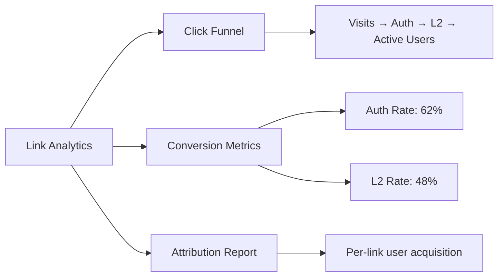

# Dynamic Access Links

## Overview

Dynamic Access Links allow a vault owner to create multiple entry points to their profile, each tailored to a specific context. Instead of sharing a single URL, the owner generates distinct links for different audiences — a professional link for recruiters, a casual link for friends, an event link for conference attendees — each controlling what content is shown, what trust level is granted, and how the profile looks.

---

## URL Format

```
https://bokunokoto.app/p/{slug}
```

| Component | Description |
|---|---|
| `bokunokoto.app` | Application domain |
| `/p/` | Profile path prefix |
| `{slug}` | Unique, human-readable identifier (e.g., `akira-tech`, `akira-friend`, `event-2026`) |

!!! tip "Slug Rules"
    Slugs must be 3–30 characters, lowercase alphanumeric with hyphens. Each slug is globally unique across all vaults. Vault owners can reserve up to 20 slugs.

---

## Link Configuration

Each access link is independently configurable:

| Setting | Type | Description |
|---|---|---|
| `slug` | string | URL identifier |
| `label` | string | Internal name for admin reference (e.g., "Recruiter Link") |
| `visible_sections` | array | Which profile sections are shown (portfolio, health, hobbies, etc.) |
| `initial_trust_level` | integer | Trust level auto-granted on authentication |
| `welcome_message` | text | Custom message displayed after login |
| `design_template` | enum | Visual theme: `professional`, `casual`, `event`, `minimal`, `custom` |
| `qa_categories` | array | Which Q&A categories are available from this link |
| `is_active` | boolean | Enable/disable without deleting |
| `expires_at` | datetime | Optional expiration |
| `max_uses` | integer | Optional usage limit |

### Design Templates

| Template | Appearance | Use Case |
|---|---|---|
| `professional` | Clean, business-card layout with muted colors | Recruiters, clients |
| `casual` | Warm, personal layout with photos | Friends, social |
| `event` | Bold header with event branding support | Conferences, meetups |
| `minimal` | Text-only, fast-loading | Accessibility-first contexts |
| `custom` | User-designed via the card builder | Any |

---

## Section Visibility Control

Each link specifies which content sections are visible, overriding the default profile layout:



!!! warning "Trust Level Still Applies"
    Section visibility from the link is an additional filter on top of trust levels. Even if a link makes the "Health" section visible, the viewer still needs the appropriate trust level to see L5+ content within that section.

---

## Link-Specific Q&A

Certain Q&A categories can be restricted to viewers who arrived via specific links:

| Link | Available Q&A Categories |
|---|---|
| `akira-tech` | `technical`, `collaboration`, `availability` |
| `akira-friend` | `personal`, `hobbies`, `events` |
| `akira-medical` | `health`, `accommodations` |

This prevents a recruiter from seeing personal Q&A threads and vice versa.

---

## Expiration and Usage Limits

| Feature | Behavior |
|---|---|
| **`expires_at`** | After this timestamp, the link shows "This link has expired" with a contact fallback |
| **`max_uses`** | After N authentications, the link is deactivated |
| **Manual deactivation** | Owner can toggle `is_active` at any time |
| **Reactivation** | Expired or deactivated links can be reactivated (usage counter resets optionally) |

---

## OTP URL Binding

For high-security links, OTP binding can be enabled:

1. Owner creates a link with `otp_binding: true`
2. The first authenticated user's `firebase_uid` is bound to the slug
3. Subsequent users attempting to use the same slug are rejected
4. This is ideal for one-on-one introductions where the link should not be forwarded

!!! info "Relationship to Smart Handshake"
    OTP-bound access links are functionally similar to Smart Handshake tokens but persistent. A Smart Handshake token expires in 5 minutes; an OTP-bound access link remains active until `expires_at` or manual deactivation, but is locked to one user.

---

## Analytics

Each access link has its own analytics dashboard:

### Tracked Metrics

| Metric | Description |
|---|---|
| **Click count** | Total visits to the link URL |
| **Unique visitors** | Distinct visitors (by IP / UID) |
| **L2 conversion rate** | % of visitors who complete profile validation |
| **Auth conversion rate** | % of visitors who complete Firebase Auth login |
| **Q&A engagement** | Number of questions asked via this link |
| **Attribution** | Which link a user came from (stored in `permissions.source_link_id`) |

### Analytics Dashboard



!!! tip "UTM Integration"
    Access links automatically append UTM-compatible parameters for external analytics tools. The format is `?ref={slug}` which can be captured by Google Analytics or similar.

---

## Admin UI

The Dynamic Access Links section in BKC provides:

### Link Creation Form

- Slug input with availability check
- Section visibility toggles (checklist)
- Trust level selector
- Design template preview
- Q&A category assignment
- Expiration and usage limit settings

### QR Generation

- One-click QR code generation for any access link
- Downloadable in PNG/SVG format
- Printable card layout with branding

### Tracking Dashboard

- Per-link analytics (clicks, conversions, active users)
- Side-by-side comparison of link performance
- Export data as CSV

---

## Data Model

```
AccessLink
├── id: bigint (PK)
├── vault_id: FK → Vault
├── slug: string (unique index)
├── label: string
├── visible_sections: jsonb (array of section IDs)
├── initial_trust_level: integer
├── welcome_message: text
├── design_template: string
├── qa_categories: jsonb (array of category strings)
├── otp_binding: boolean (default: false)
├── bound_uid: string (nullable; set on first auth if otp_binding)
├── is_active: boolean (default: true)
├── expires_at: datetime (nullable)
├── max_uses: integer (nullable)
├── current_uses: integer (default: 0)
├── created_at: datetime
└── updated_at: datetime
```
