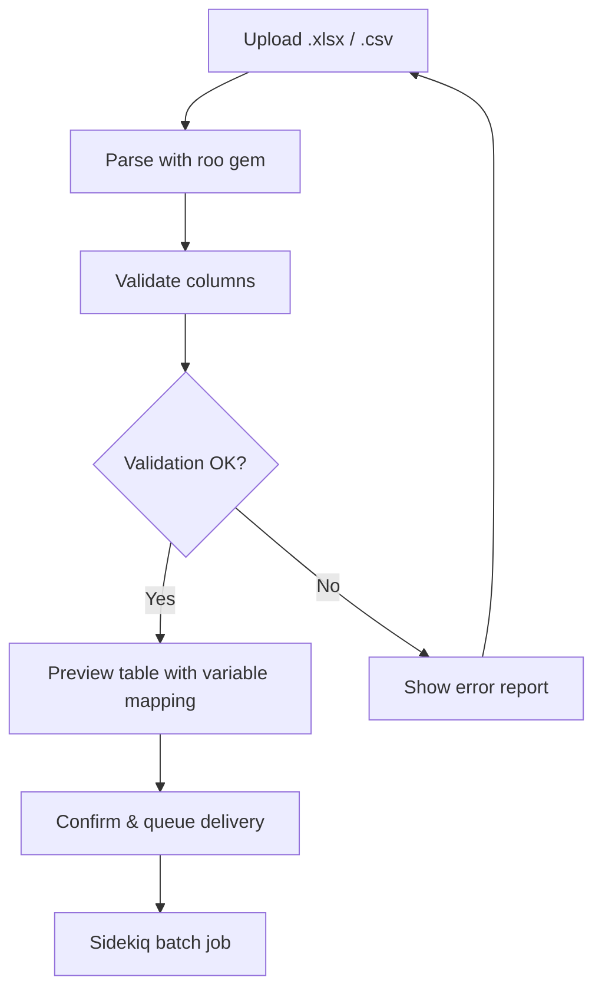
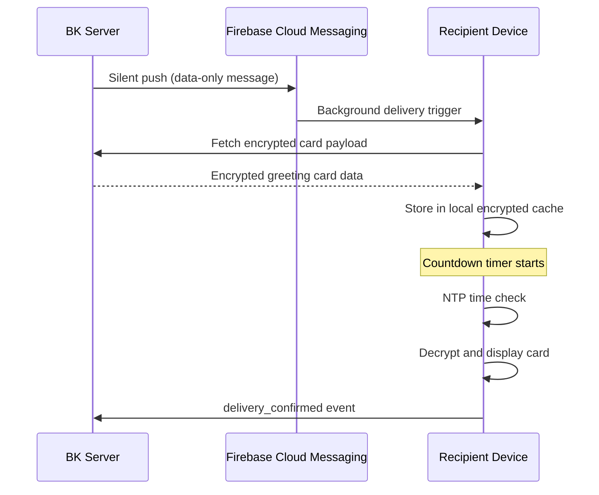

# Greeting Engine

## Overview

The Greeting Engine lets vault owners create personalized greeting cards — birthday wishes, seasonal messages, event invitations — and deliver them to connected users with precise time-lock scheduling. Cards support variable injection for batch personalization and integrate with BK's symbol system for expressive self-disclosure.

---

## Card Builder

The greeting card builder supports three editing modes:

| Mode | Description | Use Case |
|---|---|---|
| **Markdown** | Write content in Markdown with live preview | Quick text-based greetings |
| **HTML** | Full HTML/CSS editor with syntax highlighting | Custom-designed cards |
| **Drag-and-Drop** | Website builder interface (block-based) | Visual card design without code |

!!! info "Template Library"
    BK ships with a built-in template library (birthday, new year, thank you, congratulations, etc.). Templates are customizable and can be saved as personal presets.

---

## Variable Injection

Cards support dynamic variable injection using double-brace syntax:

```markdown
Dear {{name}},

Happy Birthday from {{company}}!
Your special day is {{custom_field:birthday_date}}.
```

### Supported Variables

| Variable | Source | Description |
|---|---|---|
| `{{name}}` | User profile (`real_name`) | Recipient's display name |
| `{{company}}` | User profile (`organization`) | Recipient's organization |
| `{{custom_field:key}}` | Batch import or manual entry | Any custom key-value pair |
| `{{sender_name}}` | Vault owner profile | Sender's display name |
| `{{date}}` | System | Current date (localized) |
| `{{trust_level}}` | Permission record | Recipient's current trust level |

!!! warning "Missing Variables"
    If a variable cannot be resolved, the card displays the fallback text defined in the template (default: empty string). The admin is notified of unresolved variables before send.

---

## Batch Import

For bulk greeting delivery, the engine supports Excel and CSV batch import.

### Import Flow



### Technical Stack

| Platform | Library | Notes |
|---|---|---|
| **Rails backend** | `roo` gem | Reads .xlsx, .xls, .csv, .ods |
| **Frontend preview** | SheetJS (`xlsx`) | Client-side preview before upload |

### Required Columns

| Column | Required | Description |
|---|---|---|
| `email` or `uid` | :material-check: | Recipient identifier |
| `name` | :material-check: | Maps to `{{name}}` |
| `company` | Optional | Maps to `{{company}}` |
| `custom_*` | Optional | Any column prefixed with `custom_` maps to `{{custom_field:*}}` |

---

## Time-Lock Delivery

Greeting cards support time-locked delivery — the card is pre-delivered to the recipient's device but remains encrypted and locked until the specified unlock time.

### BK Time Formula

The unlock timestamp is calculated using NTP-synced time to prevent clock manipulation:

```
unlock_at = scheduled_time (UTC) + timezone_offset (recipient)
```

!!! tip "NTP Sync"
    See [NTP Sync](../security/ntp-sync.md) for details on BK's time verification protocol. The client must pass NTP validation before content unlocks.

### Preload Protocol



1. **FCM Silent Push:** A data-only push notification triggers background fetch
2. **Encrypted Download:** The card payload is downloaded and stored locally (AES-256 encrypted)
3. **Countdown:** The app/PWA shows a countdown timer to the recipient
4. **Unlock:** At the scheduled time (NTP-verified), the card is decrypted and displayed
5. **Confirmation:** A `delivery_confirmed` event is sent back to the server

### Timezone Override

For global delivery, the admin can choose between:

- **Recipient timezone** (default) — card unlocks at the scheduled local time for each recipient
- **Sender timezone** — all cards unlock simultaneously based on the sender's timezone
- **Fixed UTC** — explicit UTC timestamp, no timezone adjustment

---

## Symbol Embedding

Greeting cards can embed BK symbols for expressive self-disclosure:

- :material-help-circle: **Help Mark** — signal accommodation needs
- :material-rainbow: **Rainbow Symbol** — LGBTQ+ expression
- :material-ear-hearing: **Ear Mark** — hearing accommodation
- :material-hand-wave: **Sign Language Mark** — sign language user
- :material-baby-carriage: **Maternity Mark** — expecting/new parent
- Custom symbols defined in the Symbol Palette

!!! note "Symbol Visibility"
    Symbols embedded in greeting cards respect the symbol's `display_level` setting. If the recipient's trust level is below the symbol's threshold, the symbol is hidden and replaced with a placeholder.

---

## BKC Admin UI

The Greeting Engine is managed from the **BK Console (BKC)** with four main sections:

### Templates

- Browse and select from the template library
- Create custom templates with the card builder
- Save and version templates

### Batch Input

- Upload Excel/CSV for bulk recipient import
- Map columns to template variables
- Preview resolved cards before sending

### Scheduler

- Calendar view for scheduling deliveries
- Set unlock time, timezone policy, and recurrence
- Draft/schedule/send workflow

### Delivery Tracker

- Real-time delivery status per recipient
- Statuses: `queued`, `preloaded`, `delivered`, `viewed`, `failed`
- Retry failed deliveries
- Export delivery report as CSV
