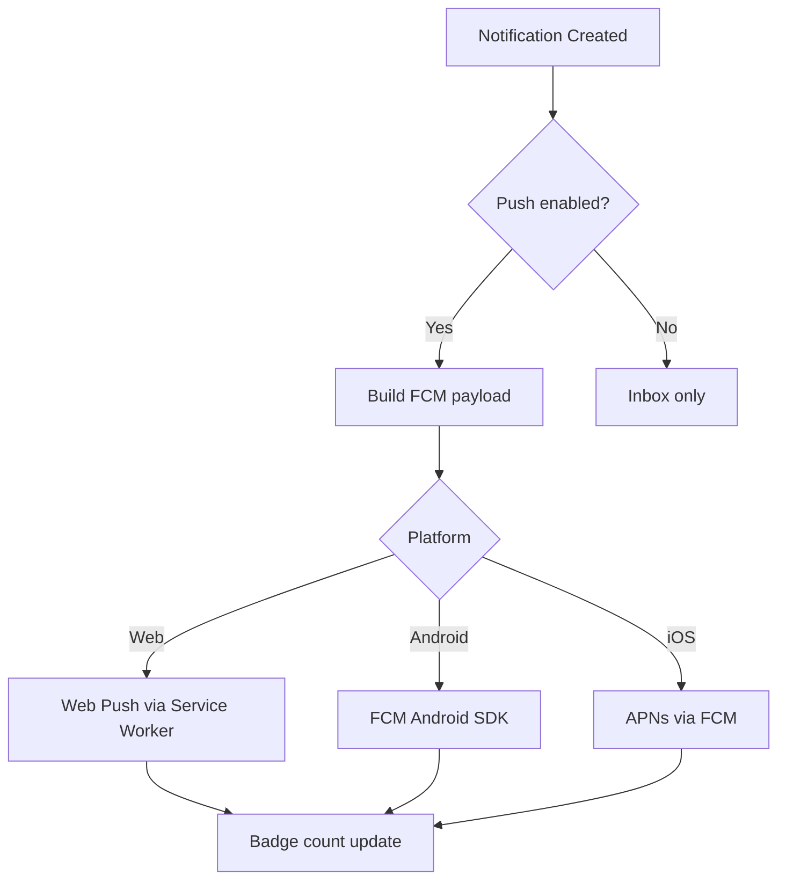
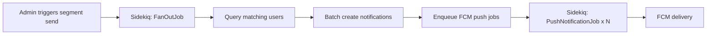

# Notification & Message Box

## Overview

BK's notification system provides a per-user inbox for all system events — from trust level changes to greeting card deliveries. Notifications support push delivery via FCM, real-time badge sync, segment-based bulk delivery, and ABC Shield integration for sensitive content.

---

## Data Model

Notifications are stored in PostgreSQL using a Firestore-inspired collection pattern:

```
Notification
├── id: bigint (PK)
├── recipient_uid: string (FK → User.firebase_uid)
├── sender_uid: string (nullable; system notifications have no sender)
├── notification_type: enum
├── category: enum
├── title: string
├── body: text (encrypted for sensitive types)
├── metadata: jsonb
├── is_read: boolean (default: false)
├── is_shielded: boolean (default: false)
├── created_at: datetime
└── expires_at: datetime (nullable)
```

!!! note "Why PostgreSQL, Not Firestore?"
    While the collection pattern mirrors Firestore's document model, BK uses PostgreSQL for notifications to keep transactional consistency with the core data model and avoid cross-database join complexity. JSONB columns provide the flexibility of a document store where needed.

---

## Notification Types

| Type | Trigger | Example |
|---|---|---|
| `level_up` | Viewer's trust level is upgraded | "Your access to Akira's vault has been upgraded to L3" |
| `disclosure` | New content is disclosed at the viewer's level | "New content is available in the Health section" |
| `qa_reply` | Vault owner replies to a Q&A question | "Akira replied to your question" |
| `greeting` | A greeting card is delivered or unlocked | "You have a new greeting card from Akira" |
| `system` | Platform announcements, security alerts | "Your session was accessed from a new device" |
| `handshake` | Someone completes a Smart Handshake | "Tanaka Yuki connected via your Conference QR" |

---

## Categories

Notifications are grouped into four categories for filtering and priority:

| Category | Types | Badge Color | Behavior |
|---|---|---|---|
| **Critical** | `system` (security), `disclosure` (L7+) | :material-circle: Red | Always shown, cannot be muted |
| **Activity** | `level_up`, `handshake` | :material-circle: Blue | Shown by default, can be muted |
| **Communication** | `qa_reply`, `greeting` | :material-circle: Green | Shown by default, can be muted |
| **System** | `system` (non-security) | :material-circle: Grey | Collapsible, auto-read after 7 days |

---

## Delivery Modes

### Individual Messages (1-to-1)

Standard notification delivery to a single recipient. Used for most event-driven notifications (level changes, Q&A replies, greetings).

### Segment Delivery

The vault owner can send notifications to a segment of connected users:

| Segment | Description | Example |
|---|---|---|
| `level:N+` | All users at trust level N or above | "All L5+ users: updated health information available" |
| `context:label` | All users with a specific context label | "All `business` contacts: office relocation notice" |
| `all` | All connected users | "Profile maintenance scheduled for Sunday" |

!!! info "Segment Limits"
    Segment delivery is limited to vault owners with fewer than 1,000 connected users. Beyond that threshold, delivery is batched and rate-limited.

---

## Push Notifications (FCM)

BK uses Firebase Cloud Messaging for push delivery across all platforms:



### FCM Payload Structure

```json
{
  "to": "<device_token>",
  "notification": {
    "title": "Level Up!",
    "body": "Your access has been upgraded to L3"
  },
  "data": {
    "notification_id": "12345",
    "type": "level_up",
    "category": "activity",
    "vault_id": "67890",
    "deep_link": "/vault/67890/notifications/12345"
  }
}
```

!!! warning "Sensitive Content in Push"
    Push notifications for shielded content (`is_shielded: true`) use a generic message body (e.g., "You have a new notification") and require opening the app to view the actual content.

---

## Real-Time Badge Sync

The unread notification count is synced to the client in real time:

| Method | Platform | Latency |
|---|---|---|
| **WebSocket** | Web (PWA) | ~100ms |
| **Polling** | Web (fallback) | 30-second interval |
| **FCM data message** | Mobile | ~1s |

### Badge Count Query

```sql
SELECT COUNT(*)
FROM notifications
WHERE recipient_uid = :uid
  AND is_read = false
  AND (expires_at IS NULL OR expires_at > NOW());
```

---

## ABC Shield for Notifications

Notifications themselves can contain sensitive content that requires protection:

| Notification Type | Shield Applied |
|---|---|
| `disclosure` (L5+) | ABC Shield Layer A + B |
| `disclosure` (L7+) | Full ABC Shield (A + B + C) |
| `system` (security alert) | Layer B (capture detection) |
| All others | No shield |

When a notification is shielded:

1. The inbox list shows a generic preview ("Sensitive notification — tap to view")
2. Opening the notification triggers ABC Shield activation
3. The notification body is decrypted in-memory and rendered via the shield pipeline

See [ABC Shield](../security/abc-shield.md) for technical details.

---

## Bulk Delivery (Fan-Out Pattern)

For segment delivery and batch notifications, BK uses Sidekiq for background processing:



### Fan-Out Implementation

1. **FanOutJob** queries all users matching the segment filter
2. Notifications are bulk-inserted into PostgreSQL (batch `INSERT`)
3. Individual **PushNotificationJob** workers are enqueued for each recipient's device tokens
4. FCM delivery is handled with exponential backoff on failure
5. Delivery status is tracked per notification (`delivered`, `failed`, `retrying`)

!!! tip "Performance"
    For segments under 100 users, fan-out is synchronous. For larger segments, Sidekiq processes in batches of 100 with a 1-second delay between batches to avoid FCM rate limits.
