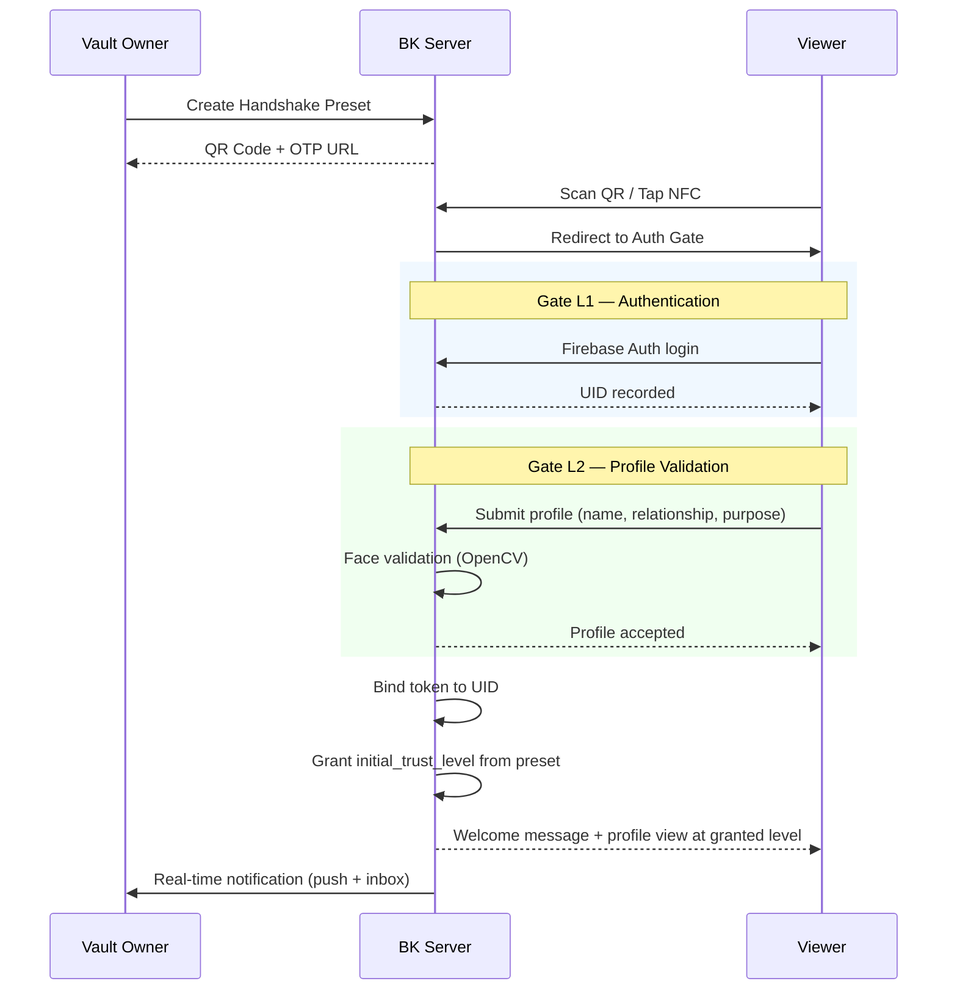
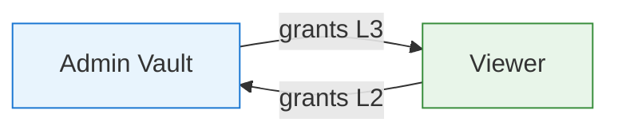

# Smart Handshake (QR / NFC)

## Overview

Smart Handshake is BK's connection protocol — a one-action flow that lets a vault owner share access with someone in person or remotely. The owner generates a preset QR code (or triggers NFC), the viewer scans it, and the system handles authentication, profile gating, and automatic level assignment in a single fluid sequence.

---

## QR Code Generation

The vault owner creates a **Handshake Preset** from the BKC admin panel. Each preset produces a unique QR code bound to specific relationship metadata.

### Preset Metadata

| Field | Type | Description |
|---|---|---|
| `context_label` | enum | Relationship context: `friend`, `business`, `event`, `medical`, `custom` |
| `initial_trust_level` | integer (0–9) | Trust level auto-granted on successful handshake |
| `welcome_message` | text | Custom message shown after connection |
| `expires_at` | datetime | QR code expiration timestamp |
| `max_uses` | integer | Maximum number of successful scans (e.g., 1 for one-on-one, 50 for event) |
| `design_template` | string | Visual template applied to the viewer's experience |

!!! example "Preset Examples"
    - **Conference booth:** context=`event`, level=L2, max_uses=200, expires in 3 days
    - **New colleague:** context=`business`, level=L3, max_uses=1, expires in 24h
    - **Close friend:** context=`friend`, level=L5, max_uses=1, expires in 1h

---

## NFC Tap-to-Connect

For supported devices, BK offers NFC as an alternative to QR scanning.

| Platform | Method | Fallback |
|---|---|---|
| **Android (Chrome)** | Web NFC API (`NDEFReader`) | QR code |
| **iOS** | Not supported (Web NFC unavailable) | QR code auto-displayed |
| **Native App (Android)** | `NfcAdapter` | QR code |
| **Native App (iOS)** | `Core NFC` (NDEF only) | QR code |

!!! info "NFC Payload"
    The NFC tag contains a URL record (`TNF_WELL_KNOWN`) pointing to the same OTP URL as the QR code. No additional data is stored on the tag.

---

## OTP URL Binding

Each handshake URL is a **one-time-password URL** bound to the first authenticated user who claims it.

```
https://bokunokoto.app/h/{token}
```

### Binding Flow

1. Admin generates preset -> system creates a signed `handshake_token`
2. First user scans the URL and authenticates (Firebase Auth)
3. The token is **permanently bound** to that user's `firebase_uid`
4. Any subsequent scan by a different UID is rejected with `403 Already Claimed`

!!! warning "Anti-Sharing Protection"
    The OTP binding prevents link forwarding. If Alice shares the URL with Bob, Bob cannot use it because Alice's UID is already bound. For multi-use presets (events), each scan binds to the scanning user but the token remains active until `max_uses` is reached.

---

## User Flow



### Gate Sequence

1. **Auth Gate (L1):** Viewer must log in via Firebase Auth. Anonymous access is blocked.
2. **Profile Gate (L2):** Viewer provides real name, relationship context, and purpose. Face validation via OpenCV confirms liveness.
3. **Auto-Level Grant:** The preset's `initial_trust_level` is written to the `permissions` table immediately.

---

## Real-Time Notifications

When a viewer completes the handshake, the vault owner receives an immediate notification:

- **Push notification** via FCM (Web Push + Mobile)
- **Inbox entry** in the Notification Message Box
- **Notification content:** Viewer name, context label, trust level granted, timestamp

!!! tip "Approval Override"
    For presets with `initial_trust_level >= L5`, the system can require explicit admin approval before the level is actually granted. This is configurable per preset via the `requires_approval` flag.

---

## Mutual Handshake Protocol

For bidirectional trust exchange, both parties can initiate a **mutual handshake**:

1. **Admin** generates a mutual-mode preset (flag: `is_mutual: true`)
2. **Viewer** scans and completes the standard flow
3. System prompts Viewer: *"Would you like to share your BK profile in return?"*
4. If Viewer accepts, the system generates a **reverse handshake token** linking back to the Viewer's vault
5. Admin receives the reverse token and can accept/reject the reciprocal connection
6. On acceptance, both users have permissions entries in each other's vaults



---

## Security

### Signed Temporary Tokens

- Tokens are **HMAC-SHA256 signed** with a server-side secret
- **Validity:** 5 minutes from generation (configurable)
- After expiry, the QR code displays a "Link expired" message with an option to request a new one
- Token payload: `{ vault_id, preset_id, created_at, nonce }`

### Audit Log

Every scan event is recorded in the `audit_logs` table:

| Field | Value |
|---|---|
| `event_type` | `handshake_scan` |
| `actor_uid` | Viewer's Firebase UID (or `anonymous` if pre-auth) |
| `vault_id` | Target vault |
| `metadata` | `{ preset_id, context_label, ip, user_agent, geo }` |
| `outcome` | `success`, `expired`, `already_claimed`, `max_uses_reached` |
| `created_at` | Timestamp |

!!! note "Rate Limiting"
    Handshake endpoints are rate-limited to **10 scans per IP per minute** to prevent brute-force token enumeration.
