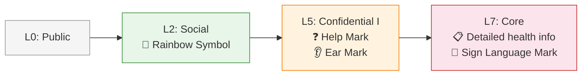
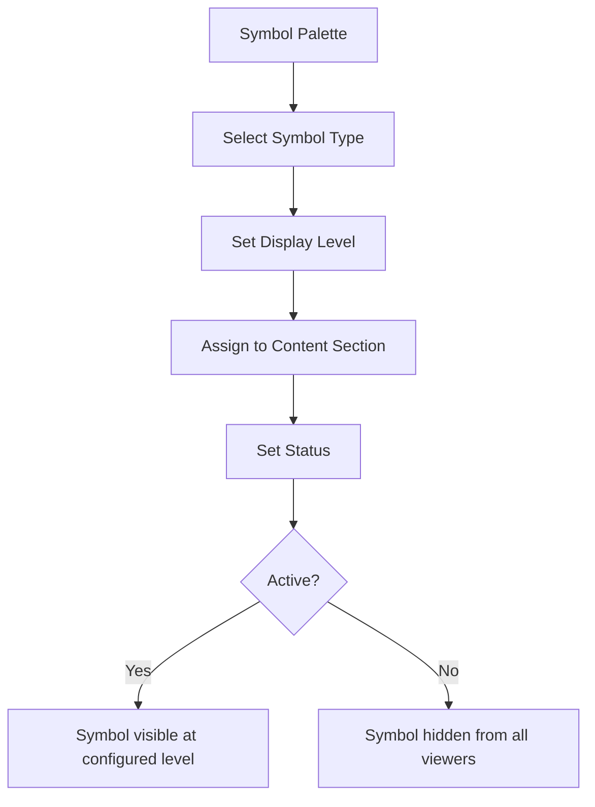

# Symbolic Disclosure

## Overview

Symbolic Disclosure allows vault owners to communicate important personal attributes — disabilities, identities, accommodations — through universally recognized symbols. Each symbol is tied to a trust level, ensuring sensitive information is only revealed to appropriately trusted viewers.

---

## Supported Symbols

| Symbol | Icon | Description | Typical Display Level |
|---|---|---|---|
| **Help Mark** | :material-help-circle: | Indicates the person has a non-visible disability or condition requiring accommodation | L5 |
| **Rainbow Symbol** | :material-rainbow: | LGBTQ+ identity expression | L2 |
| **Ear Mark** | :material-ear-hearing: | Hearing difficulty or use of hearing aids | L5 |
| **Sign Language Mark** | :material-hand-wave: | User communicates via sign language | L3 |
| **Maternity Mark** | :material-baby-carriage: | Pregnancy or early-stage parenthood | L4 |
| **Custom Symbol** | :material-palette: | User-defined symbol for any purpose | Configurable |

!!! info "Symbol Standards"
    Help Mark, Ear Mark, and Maternity Mark follow the Japanese standardized assistance marks (JIS). Rainbow Symbol follows international LGBTQ+ representation conventions. Custom symbols are user-created and not bound to any standard.

---

## Display Level Control

Each symbol has a `display_level` setting that determines the minimum trust level required to see it.

### Configuration Model

```
Symbol
├── symbol_type: enum (help_mark, rainbow, ear_mark, sign_language, maternity, custom)
├── display_level: integer (0–9)
├── label: string ("Help Mark", "Rainbow", etc.)
├── alt_text: string (accessibility description)
├── status: enum (active, inactive)
└── content_section_id: FK → Content
```

### Example: Progressive Disclosure



!!! example "Disclosure Progression"
    - **L2 (Social):** Rainbow Symbol is shown — a general identity expression appropriate for acquaintances
    - **L5 (Confidential I):** Help Mark and Ear Mark appear — the viewer now learns about accommodation needs
    - **L7 (Core):** Detailed health information, specific conditions, and sign language preferences are disclosed

---

## Accessibility

All symbols are rendered with proper accessibility attributes:

```html
<span
  role="img"
  aria-label="Help Mark: This person has a non-visible condition that may require accommodation"
  class="bk-symbol bk-symbol--help-mark"
>
  
</span>
```

### Accessibility Requirements

- Every symbol has a descriptive `alt` text and `aria-label`
- Symbols are keyboard-navigable and focusable
- Screen readers announce the symbol's meaning, not just its visual name
- High-contrast mode ensures symbols remain visible against all backgrounds
- Symbol tooltips provide additional context on hover/focus

---

## BKC Symbol Palette

The **Symbol Palette** is the admin interface for managing symbolic disclosure:

### Features

- **Assign symbols to content sections:** Drag a symbol onto a content block to associate them
- **Set display levels:** Per-symbol level slider (L0–L9)
- **Custom symbol creator:** Upload SVG/PNG, define alt text and label
- **Preview by level:** Toggle through trust levels to see which symbols appear at each
- **Bulk management:** Enable/disable multiple symbols at once



---

## Status Indicator

Each symbol supports a real-time **status indicator** that communicates the current relevance of the symbol:

| Status | Display | Meaning |
|---|---|---|
| `active` | :material-circle: Green badge | "Currently need accommodation" or "Active and available" |
| `inactive` | :material-circle-outline: Grey badge | "Not currently relevant" or "Paused" |

!!! example "Status Use Cases"
    - **Help Mark (active):** "I am currently experiencing symptoms and may need help"
    - **Help Mark (inactive):** "I have this condition but it is not affecting me right now"
    - **Maternity Mark (active):** "I am currently pregnant / on parental leave"
    - **Maternity Mark (inactive):** "This symbol was previously relevant"

The vault owner can toggle status at any time from the BKC Symbol Palette.

---

## Auto-Shield Integration

Sensitive symbol content at **L5 and above** automatically triggers the ABC Shield:

!!! warning "Auto-Shield Rule"
    Any symbol with `display_level >= 5` has ABC Shield **forced on** for the content section it is attached to. This cannot be overridden by the vault owner — it is a system-enforced protection for sensitive health and accommodation data.

### Shield Behavior

- **L5–L6 symbols:** ABC Shield Layer A (video stream rendering) + Layer B (capture detection)
- **L7+ symbols:** Full ABC Shield (Layer A + B + C) + dynamic watermark

See [ABC Shield](../security/abc-shield.md) for technical details on each protection layer.
