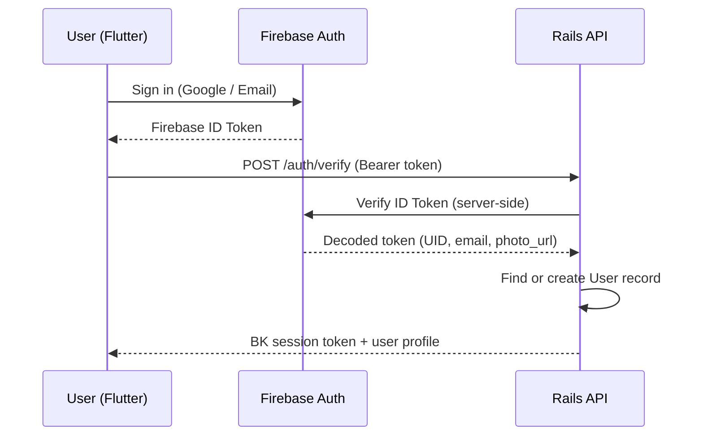

# Authentication & Face Validation

## Authentication Flow



## L1 Gate: Login Required

From L1 onward, all API requests must include a valid Firebase ID Token. The Rails backend verifies the token server-side using the `firebase-id-token` gem or equivalent.

```ruby
class ApplicationController < ActionController::API
  before_action :authenticate_user!

  private

  def authenticate_user!
    token = request.headers['Authorization']&.split('Bearer ')&.last
    decoded = FirebaseIdToken.verify(token)
    @current_user = User.find_by(firebase_uid: decoded['uid'])
    render_unauthorized unless @current_user
  end
end
```

## L2 Gate: Profile Completion + Face Validation

### Profile Requirements

To access L2+ content, the viewer must provide:

| Field | Purpose |
|---|---|
| Real name | Identity confirmation (not necessarily legal name) |
| Relationship to discloser | "High school friend", "colleague at Company X" |
| Purpose of viewing | "Staying in touch", "Business collaboration" |
| Profile photo with face | Passed OpenCV Haar Cascade face detection |

### Face Validation (Non-AI)

The system uses **OpenCV's Haar Cascade classifier** — a traditional pattern-matching algorithm (not deep learning) — to detect whether a face is present in the profile photo.

```ruby
# app/services/face_detector_service.rb
require 'opencv'

class FaceDetectorService
  CASCADE_PATH = Rails.root.join(
    'vendor/assets/opencv/haarcascade_frontalface_default.xml'
  ).to_s

  def self.contains_face?(image_path)
    detector = OpenCV::CvHaarClassifierCascade.load(CASCADE_PATH)
    image = OpenCV::IplImage.load(image_path)
    faces = detector.detect_objects(image)
    faces.any?
  rescue => e
    Rails.logger.error "Face Detection Error: #{e.message}"
    false
  end
end
```

**Workflow:**

1. User logs in → IdP provides `photo_url`
2. Rails downloads and runs face detection
3. If face detected → `face_verified_at` is set → L2 unlocked
4. If no face → user is prompted to upload a photo with their face visible
5. Re-upload triggers re-validation

### Preset QR Shortcut

When a viewer scans a **preset QR code** created by the vault owner (e.g., "Friend meetup QR"), the relationship field can be auto-populated, reducing the friction of L2 registration.

## Future: eKYC (Release Phase, ~12 months)

At the paid release, **eKYC (electronic Know Your Customer)** will be introduced alongside billing:

- **Provider:** TRUSTDOCK, Liquid, or equivalent SDK
- **Verification:** Government ID (My Number Card, driver's license) + liveness check
- **Integration:** Flutter SDK → Rails Webhook
- **Effect:** Verified users receive a "Verified" badge; vault owners can require eKYC for L4+ access

!!! info "Beta Phase"
    During beta, OpenCV face detection + self-reported profile serves as the identity layer. eKYC is deferred to reduce onboarding friction.
