# Trust Levels (L0–L9)

## Overview

BK's 10-level trust system creates a gradient from public information to the most intimate self-disclosure. Each level adds stricter authentication requirements and stronger security guards.

## Level Definitions

### Surface Layer (L0–L2) — Public & Initial Contact

#### L0: Public

- **Target:** Anyone with the URL
- **Authentication:** None
- **Content:** Alias/nickname, one-line message, BK system overview
- **Security:** None
- **Purpose:** Landing page, entry point to login flow

#### L1: Contact — :material-lock: Authentication Required

- **Target:** Anyone who logs in
- **Authentication:** Firebase Auth login (Google, Email, SNS)
- **Content:** Basic portfolio, professional contact info
- **Security:** All access is logged with UID
- **Purpose:** Identify *who* is viewing — anonymous access ends here

#### L2: Social — :material-account-check: Profile + Face Validation Required

- **Target:** Users who provide personal details and pass face check
- **Authentication:** Detailed profile input (real name, relationship to discloser, purpose) + OpenCV face validation
- **Content:** Hobbies, detailed SNS links, Rainbow Symbol (LGBTQ+ expression)
- **Security:** Profile data stored encrypted; face validation timestamp recorded
- **Purpose:** Mutual trust exchange — "I'll share more if you tell me who you are"

---

### Trust Layer (L3–L5) — Business & Confidential

#### L3: Business

- **Target:** Professional contacts, project collaborators
- **Authentication:** L2 complete + context match
- **Content:** Detailed work history, skill stack, ongoing project summaries
- **Security:** Standard audit logging

#### L4: Trusted Partner

- **Target:** Long-term business partners, co-developers
- **Authentication:** L2 complete + ongoing relationship
- **Content:** Availability schedule, supplementary documents
- **Security:** **Web client maximum** — content beyond L4 requires the native app
- **Purpose:** Upper boundary of what can be shown on the web

#### L5: Confidential I — :material-headphones: Earphone Required

- **Target:** Trusted acquaintances who need to know about accommodations
- **Authentication:** Manual approval by vault owner
- **Content:** Help Mark display, overview of accommodations needed (disability, health)
- **Security:**
    - :material-headphones: **Secure TTS** — screen reader output is blocked unless earphones/earpiece are connected
    - App recommended (native security guards enabled)
- **Purpose:** The threshold where "sensitive personal information" begins

---

### Vault Layer (L6–L9) — Core Self-Disclosure

#### L6: Human Relational

- **Target:** Close friends, counselors, mentors
- **Authentication:** Manual approval
- **Content:** Detailed values, past struggles, light grief sharing
- **Security:**
    - :material-watermark: Dynamic watermark overlay (user ID + timestamp)
    - :material-headphones: Earphone-only TTS

#### L7: Confidential II — :material-camera: :material-map-marker: Full Surveillance

- **Target:** Deeply trusted individuals
- **Authentication:** Manual approval + environmental gate
- **Content:** Core coming-out content (disability details, LGBTQ+ journey, deep grief)
- **Security:**
    - :material-camera: Camera face capture required before viewing
    - :material-map-marker: GPS location capture required
    - :material-clock: NTP time sync verification
    - :material-watermark: Dynamic watermark
    - :material-headphones: Earphone-only TTS

!!! danger "Permission Denial = Permanent Block"
    If the viewer denies camera or GPS permission, the content is **permanently locked** for that user. The system writes `is_blocked: true` to prevent future access.

#### L8: Core / Inner

- **Target:** Family, life partners, closest confidants
- **Authentication:** Manual approval
- **Content:** Core medical information, emergency contacts, life-altering secrets
- **Security:**
    - All L7 guards
    - :material-fire: **Burn-After-Reading** available — content can be set to auto-delete after first viewing

#### L9: Master / Admin

- **Target:** The vault owner (yourself)
- **Authentication:** 2FA / FIDO2
- **Content:** Full BKC access — all content editing, user management, audit log viewing
- **Security:** Admin-only; not a disclosure level

## Security Matrix Summary

| Level | Content Type | Platform | Audio | Camera/GPS | Watermark | Burn |
|---|---|---|---|---|---|---|
| L0–L2 | Public / Social | Web + App | Open | No | No | No |
| L3–L4 | Business | Web + App | Open | No | No | No |
| L5 | Accommodations | App recommended | :material-headphones: Earphone | No | No | No |
| L6 | Relational | App only | :material-headphones: Earphone | No | :material-watermark: Yes | No |
| L7 | Deep Disclosure | App only | :material-headphones: Earphone | :material-camera: :material-map-marker: Yes | :material-watermark: Yes | No |
| L8 | Core | App only | :material-headphones: Earphone | :material-camera: :material-map-marker: Yes | :material-watermark: Yes | :material-fire: Optional |
| L9 | Admin | Web + App | N/A | N/A | N/A | N/A |

## Level Progression Flow

```mermaid
flowchart LR
    L0["L0: Public<br/>Anyone"] -->|Login| L1["L1: Contact<br/>Authenticated"]
    L1 -->|Profile + Face| L2["L2: Social<br/>Verified"]
    L2 -->|Context match| L3["L3: Business"]
    L3 -->|Relationship| L4["L4: Partner"]
    L4 -->|Manual approval| L5["L5: Confidential I"]
    L5 -->|Manual approval| L6["L6: Relational"]
    L6 -->|Camera/GPS gate| L7["L7: Confidential II"]
    L7 -->|Manual approval| L8["L8: Core"]
    L8 -.->|Owner only| L9["L9: Master"]
```

