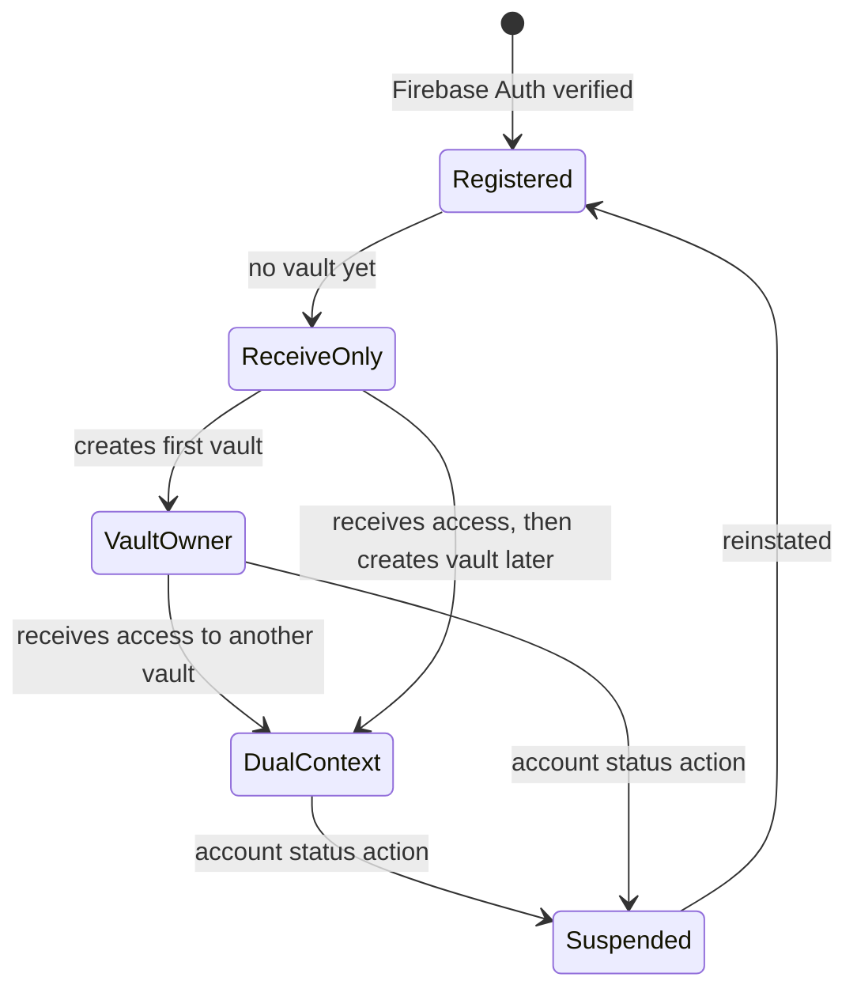

# Account & Role Model

## Principle

Bokunokoto uses a **one-person, one-account** model. A `User` represents a real authenticated person, not a permanent product role. The same user can disclose their own information through a vault and receive information from someone else's vault.

This keeps the account model stable as BK grows from a personal disclosure tool into a reciprocal trust network.

## Core Concepts

| Concept | Meaning | Notes |
|---|---|---|
| `User` | Authenticated person | Identity, login, profile, verification, and account status live here. |
| `Vault` | Disclosure space owned by a user | Initial product scope is 0 or 1 vault per user. The model should not block future multi-vault support. |
| `Permission` / `ViewerRelationship` | Relationship between a viewer and a vault | Stores trust level, relationship context, approval state, source link, and owner notes. |
| `AccountCapability` | What the user can do in the product | Examples: can create a vault, can access BKC, receive-only state, beta flags, billing gates. |

`User.role` may remain as a short-term console/admin implementation detail, but it must not become the source of truth for whether someone is a discloser or a receiver.

## Relationship Contexts

A user has different capabilities depending on the current context:

| Context | Source of truth | Example capability |
|---|---|---|
| Own-vault context | `Vault.owner_user_id == current_user.id` | Edit content, manage access links, review audit logs. |
| Viewer context | `Permission.user_id == current_user.id` for another vault | View permitted content, submit questions, receive greetings. |
| Operator context | Platform-level admin grant | Support, compliance, abuse response, and emergency operations. |

The client may show these as mode switches, but the backend authorizes each request from the current resource relationship.

## Initial Account Lifecycle

## Authorization Rules

| Action | Required relationship |
|---|---|
| View public vault info | Optional auth, L0 rules apply |
| View protected content | Permission for target vault plus trust/security gates |
| Create or edit own content | Current user owns the target vault and has BKC capability |
| Update viewer trust level | Current user owns the target vault |
| Send greeting | Current user owns sender vault; recipient is a connected user |
| Read notifications | Current user is the notification recipient |

## Implementation Notes

- Add `Vault.owner_user_id` or keep `Vault.user_id` with clear owner semantics.
- Keep trust level per vault relationship, not globally on `users`. A global `users.trust_level` can exist only as legacy/admin display until relationship permissions replace it.
- Use `AccountCapability` or equivalent fields to express product access: `can_create_vault`, `bkc_enabled`, `receive_only`, `billing_plan`, and beta access.
- Avoid Firebase custom claims that imply permanent product roles such as `isAdmin` for personal vault ownership. Claims may reference platform operators, but vault ownership is checked against database relationships.

## Migration Direction

1. Keep the current `User` table as the identity anchor.
2. Introduce vault ownership and relationship permissions as separate records.
3. Move viewer trust from `users.trust_level` to the per-vault permission record.
4. Replace role-based UI gates with relationship/capability checks.
5. Preserve existing console user management as an operator view until BKC ownership screens are implemented.
