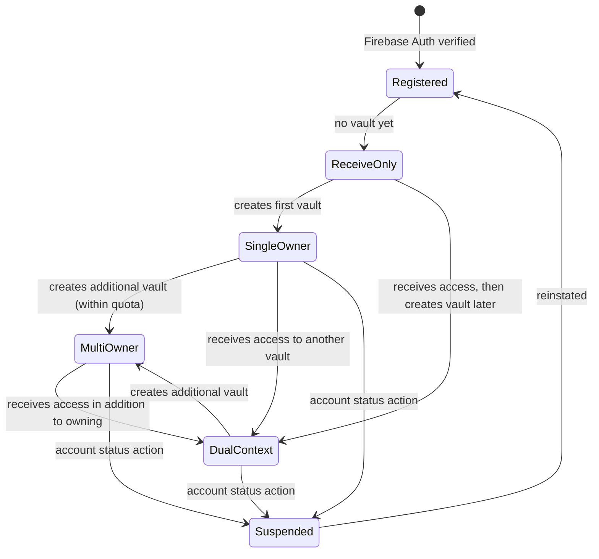

# Account & Role Model

## Principle

Bokunokoto uses a **one-person, one-account, many-vaults** model. A `User` represents a real authenticated person, not a permanent product role. The same user can disclose their own information through **one or more vaults** and receive information from someone else's vault.

This keeps the account model stable as BK grows from a personal disclosure tool into a reciprocal trust network with multiple disclosure surfaces per person — close in shape to the Facebook account ↔ multiple Pages relationship, with Instagram's account-switcher UX for moving between them.

See [Multi-Tenant Model](multi-tenant-model.md) and [Comparative Analysis](comparative-analysis.md) for the full architectural rationale.

## Core Concepts

| Concept | Meaning | Notes |
|---|---|---|
| `User` | Authenticated person | Identity, login, profile, verification, and account status live here. |
| `Vault` | Disclosure tenant owned by a user | A user can own multiple vaults (capped by `AccountCapability.vault_quota`, default 3). Each vault is a self-contained disclosure surface with its own contents, viewers, links, and audit history. |
| `Permission` / `ViewerRelationship` | Relationship between a viewer and a vault | Stores trust level, relationship context, approval state, source link, and owner notes. |
| `AccountCapability` | What the user can do in the product | Examples: vault quota, can access BKC, receive-only state, beta flags, billing gates. |
| `ActiveVaultContext` | Runtime selection of which vault the user is currently acting in | Persisted per-device as `active_vault_id`; canonical default is `users.default_vault_id`. Sent on every API request as `X-BK-Active-Vault`. |

`User.role` may remain as a short-term console/admin implementation detail, but it must not become the source of truth for whether someone is a discloser or a receiver.

## Relationship Contexts

A user has different capabilities depending on the current context:

| Context | Source of truth | Example capability |
|---|---|---|
| Own-vault context | `Vault.owner_user_id == current_user.id` | Edit content, manage access links, review audit logs. |
| Viewer context | `Permission.user_id == current_user.id` for another vault | View permitted content, submit questions, receive greetings. |
| Operator context | Platform-level admin grant | Support, compliance, abuse response, and emergency operations. |

The client may show these as mode switches, but the backend authorizes each request from the current resource relationship.

## Account Lifecycle (multi-tenant)

## Authorization Rules

| Action | Required relationship |
|---|---|
| View public vault info | Optional auth, L0 rules apply |
| View protected content | Permission for target vault plus trust/security gates |
| Create or edit own content | Current user owns the target vault and has BKC capability |
| Update viewer trust level | Current user owns the target vault |
| Send greeting | Current user owns sender vault; recipient is a connected user |
| Read notifications | Current user is the notification recipient |

## Implementation Notes

- Keep `vaults.user_id` as the owner FK (no destructive rename). Expose it in code as `vault.owner` via `belongs_to :owner, class_name: "User", foreign_key: :user_id`.
- Trust level is per vault relationship, not globally on `users`. A global `users.trust_level` exists only as legacy/admin display until relationship permissions replace it.
- Use `AccountCapability` to express product access: `vault_quota` (int, default 3), `bkc_enabled`, `receive_only`, `billing_plan`, and beta access.
- Firebase custom claims may reference platform operators only. Vault ownership and trust are checked against database relationships, never claims.

## Migration Direction

1. Keep the current `User` table as the identity anchor.
2. Lift the unique index on `vaults.user_id`; allow many vaults per user.
3. Backfill `users.default_vault_id` so existing single-vault users keep a stable seed.
4. Introduce vault quota via `AccountCapability.vault_quota`.
5. Add the `X-BK-Active-Vault` header contract and resolve the active vault on every authenticated request.
6. Move viewer trust from `users.trust_level` to the per-vault permission record.
7. Replace role-based UI gates with relationship/capability checks.
8. Preserve existing console user management as an operator view until BKC ownership screens are migrated.
