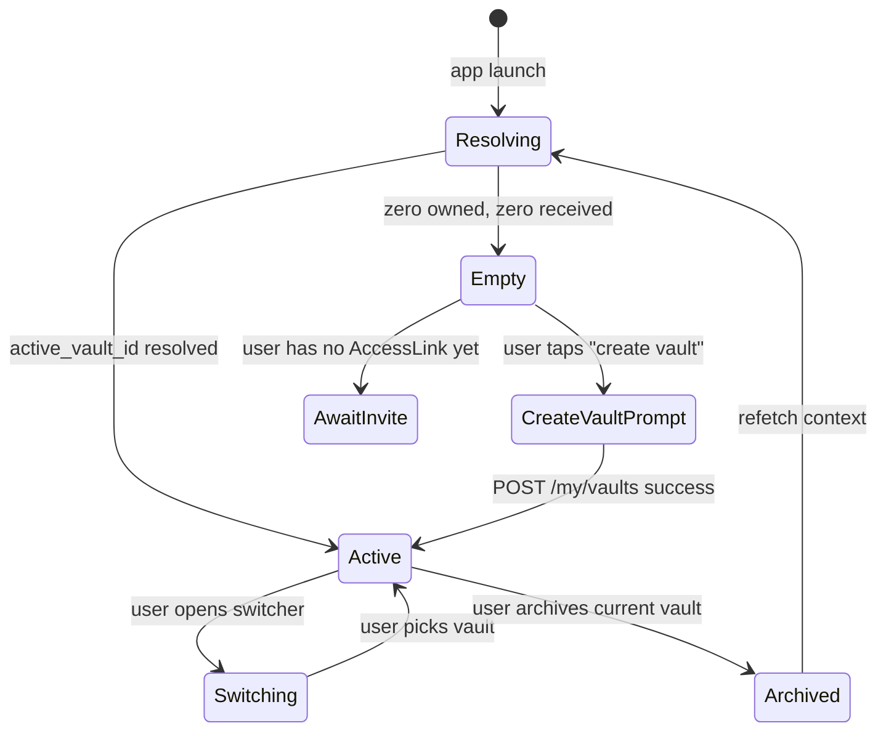

# Client Context Switching

## Goal

One Firebase identity, many vaults. The client must let the user move between owned vaults and received vaults without re-authentication, and the backend must authorize every request against the resolved active vault.

The pattern is closest to Instagram's account switcher and Facebook's "Pages Manager" tab: a single login holds a set of contexts, and the user picks the one they want to act in.

## State machine



## Resolution order (client launch)

1. Read `active_vault_id` from secure on-device storage.
2. If absent, call `GET /api/v1/account/context` and use `default_vault_id`.
3. If still absent and the user owns at least one vault, set the most-recently-updated owned vault as active and persist it.
4. If still absent and the user has at least one received vault permission, set the most-recently-active received vault as active.
5. If still absent, show the **empty state**: a card explaining "You can create a vault or wait for someone to share theirs," with a primary "Create my first vault" button and a secondary "I have an invitation link" button.

## Switcher UI

| Surface         | Pattern                                                                                  |
|-----------------|------------------------------------------------------------------------------------------|
| Flutter mobile  | App bar dropdown showing current vault display name, avatar, and L-context badge        |
| Flutter web     | Left rail with two sections: "Your vaults" and "Shared with you"                         |
| BKC (Rails)     | Top-right dropdown with the same two sections plus an "Operator override" entry if applicable |

Behavior:

- Tap a vault → set `active_vault_id` in storage, send `PATCH /api/v1/my/active_vault` (best-effort sync), refresh all open screens.
- Long-press / right-click → "Set as default" (calls `PATCH /api/v1/my/default_vault`).
- Search bar above the list when the user owns/received > 8 vaults.
- Vault avatar uses `vault.display_name` initial + deterministic color, or an uploaded image once the asset upload feature ships.

## Header contract

Every request from the client carries:

```
Authorization: Bearer <firebase-id-token>
X-BK-Platform: web | ios | android
X-BK-Active-Vault: <vault.slug or vault.id>
X-BK-Time-Anchor: <iso8601 from BK Time>
```

The server resolves the vault context as:

```ruby
def current_vault
  scope = if params[:vault_id].present?
            Vault.find(params[:vault_id])
          elsif request.headers["X-BK-Active-Vault"].present?
            Vault.find_by(slug: request.headers["X-BK-Active-Vault"]) ||
              Vault.find(request.headers["X-BK-Active-Vault"])
          elsif current_user.default_vault_id
            current_user.owned_vaults.find(current_user.default_vault_id)
          end
  return scope if scope && authorized_for_vault?(scope)
  raise Bkc::ActiveVaultRequired
end
```

`Bkc::ActiveVaultRequired` is rendered as `409` with the owned-vault list, so the client can prompt the switcher.

## Per-device persistence

- Mobile: encrypted shared preferences (`flutter_secure_storage`).
- Web: `sessionStorage` for the active vault id, `localStorage` for the **last** active vault id (used as the seed on next visit).
- BKC: signed cookie `bk_active_vault` scoped to the user, refreshed on every BKC request.

The active vault id is **not** stored on `users` as an authoritative field. The server-side `users.default_vault_id` is the user's preferred seed; the device-local `active_vault_id` is the runtime selection. This mirrors how Instagram persists last-active account per device but keeps the canonical default user-side.

## Switching while a long-lived stream is open

Forensic monitor in BKC and the Flutter "live activity" view subscribe to per-vault streams. When the user switches:

1. Close the current EventSource / WebSocket.
2. Update `X-BK-Active-Vault`.
3. Open a fresh stream for the new vault.
4. Show a one-line toast: "Switched to *<vault.display_name>*".

There is no cross-vault stream. A user who wants to monitor multiple vaults can pop them into separate browser tabs (each tab carries its own active vault).

## Accessibility

- Switcher items expose `Semantics(label: "Vault: $name, your vault, currently active")` or `"shared with you by $owner_name"`.
- Voice control: "Switch to vault *<name>*" is a registered intent on iOS / Android via the existing semantic graph.
- Screen reader announces the active vault on every navigation event.
- Keyboard: `Cmd/Ctrl + Shift + V` opens the switcher on web/BKC; arrow keys + Enter pick.

## Edge cases

| Case                                                          | Behavior                                                                            |
|---------------------------------------------------------------|-------------------------------------------------------------------------------------|
| Active vault gets archived from another device                | Next request → `409`; switcher reopens; toast: "This vault was archived."           |
| Active vault loses permission (owner revoked it)              | Next request → `403` with `error: "permission_revoked"`; switcher reopens          |
| User on web hits a route that requires L5+ in the active vault| Existing L4 cap response; switcher remains on the L4-capped vault                  |
| Operator override active                                      | Switcher shows a red "operator context" pill; the override token is included in headers |

## Test cases

- New user → empty state appears with both CTAs.
- User with one owned vault → that vault is auto-active; switcher hidden until a second vault appears.
- User with two owned + one received → switcher shows three entries grouped under two headers.
- User archives active vault → empty state if it was the only one, else switcher promotes another owned vault.
- API call to `/my/contents` without `X-BK-Active-Vault` returns `409` with owned vault list, not `500`.
