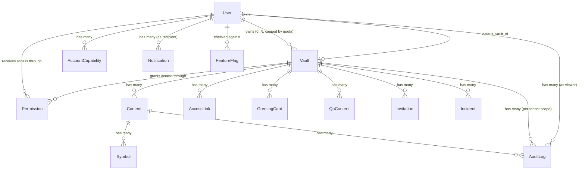

# Data Model

!!! info "Multi-tenant update"
    As of the multi-tenant rewrite, `User` owns **many** `Vault` rows (capped by `AccountCapability.vault_quota`, default 3). See [Multi-Tenant Model](multi-tenant-model.md) for the full design and migration plan. This page documents the canonical schema after the rewrite.

## Entity Relationship Diagram



## Core Models

### User

`User` is the identity anchor for a real person. It is not the permanent source of truth for whether someone is a discloser or a receiver. The same user may own a vault and receive access to other vaults.

| Column | Type | Notes |
|---|---|---|
| `id` | bigint | Primary key |
| `firebase_uid` | string | Unique, from Firebase Auth |
| `email` | string | Encrypted |
| `real_name` | string | Encrypted; required for L2+ |
| `organization` | string | Optional profile attribute; relationship-specific context belongs on Permission |
| `purpose` | text | Optional profile attribute; relationship-specific purpose belongs on Permission |
| `photo_url` | string | Profile image URL from IdP |
| `face_verified_at` | datetime | Timestamp when OpenCV face validation passed |
| `is_admin` | boolean | Platform/operator flag only; personal BKC access comes from vault ownership and capability |
| `created_at` | datetime | |

### Vault

`Vault` is a disclosure tenant owned by a user. A user can own multiple vaults, each capped by `AccountCapability.vault_quota` (default 3). The vault is the boundary for every per-tenant resource: contents, audit logs, access links, greetings, Q&A, incidents, and analytics. See [Multi-Tenant Model](multi-tenant-model.md) for the full design.

| Column | Type | Notes |
|---|---|---|
| `id` | bigint | Primary key |
| `user_id` | bigint | FK → User (owner). Indexed but **not unique** — one user can own multiple vaults. Exposed in code as `vault.owner`. |
| `display_name` | string | Owner-facing name |
| `slug` | string | URL-safe identifier, unique per owner (used by `X-BK-Active-Vault` header) |
| `kind` | enum | `personal` / `professional` / `medical` / `social` / `legal` / `other` — hint for default symbol palette and onboarding copy |
| `bio` | text | Short introduction (L0 visible) |
| `archived_at` | datetime | Nullable; non-null means soft-archived; archived vaults are excluded from `account/context` lists unless `include_archived=true` |
| `created_at` | datetime | |

!!! warning "Unique-index removal"
    The pre-rewrite schema had `UNIQUE INDEX vaults_on_user_id`. The migration drops it and replaces it with a non-unique index. Tests that asserted "a user cannot create a second vault" are obsolete and replaced by quota-based assertions (see the multi-tenant rollout plan).

### Default vault pointer (on User)

`users.default_vault_id` (nullable, FK → `vaults`) is the user's preferred seed for the client context switcher. It is set on first vault creation and can be changed via `PATCH /api/v1/my/default_vault`. Archiving the referenced vault clears the pointer.

### Content (Disclosure)

| Column | Type | Notes |
|---|---|---|
| `id` | bigint | Primary key |
| `vault_id` | bigint | FK → Vault |
| `title` | string | Encrypted (deterministic for search) |
| `body` | text | Encrypted (non-deterministic) |
| `format` | enum | `markdown` / `html` |
| `required_level` | integer | 0–9 |
| `symbol_type` | string[] | `help_mark`, `rainbow`, `ear_mark`, `maternity`, `custom` |
| `is_antigravity_enabled` | boolean | Apply ABC Shield (video stream blackout) |
| `is_burn_after_reading` | boolean | One-time view; deleted after reading |
| `audio_protection_required` | boolean | Require earphone for TTS |
| `camera_required` | boolean | Require camera capture before viewing |
| `gps_required` | boolean | Require GPS before viewing |
| `permitted_user_ids` | bigint[] | Individual whitelist (overrides level) |
| `created_at` | datetime | |

### Permission

`Permission` is the relationship between a viewer and a vault. Trust is per relationship, so one user can be L5 for one vault and L1 for another.

| Column | Type | Notes |
|---|---|---|
| `id` | bigint | Primary key |
| `vault_id` | bigint | FK → Vault (whose vault) |
| `user_id` | bigint | FK → User (the viewer) |
| `granted_level` | integer | 0–9, manually set by vault owner |
| `relationship_context` | string | "colleague", "friend", "business partner" |
| `status` | enum | `pending` / `active` / `blocked` / `revoked` |
| `purpose` | text | Viewer's stated reason for access to this vault |
| `admin_note` | text | Owner's private note about this viewer |
| `source_access_link_id` | bigint | FK → AccessLink (how they connected) |
| `created_at` | datetime | |

### AccountCapability

| Column | Type | Notes |
|---|---|---|
| `id` | bigint | Primary key |
| `user_id` | bigint | FK → User |
| `name` | string | e.g., `create_vault`, `bkc_access`, `receive_only`, `beta_access` |
| `enabled` | boolean | Whether the capability is active |
| `source` | string | `system`, `billing`, `operator`, `beta`, `migration` |
| `expires_at` | datetime | Nullable |
| `created_at` | datetime | |

### AccessLink

| Column | Type | Notes |
|---|---|---|
| `id` | bigint | Primary key |
| `vault_id` | bigint | FK → Vault |
| `slug` | string | Unique URL path (e.g., `recruit-nssol-2026`) |
| `preset_context` | string | "Tech Conference 2026", "Friend meetup" |
| `initial_level` | integer | Auto-granted level after L2 completion |
| `welcome_message` | text | Custom greeting shown after scan |
| `template` | string | `professional` / `casual` / `event` |
| `visible_fields` | string[] | Which profile sections to show |
| `max_uses` | integer | Nullable; limit number of activations |
| `use_count` | integer | Current activation count |
| `bound_user_id` | bigint | Nullable; FK → User (bound after first use) |
| `expires_at` | datetime | Nullable |
| `created_at` | datetime | |

### AuditLog

| Column | Type | Notes |
|---|---|---|
| `id` | bigint | Primary key |
| `user_id` | bigint | FK → User (viewer) |
| `content_id` | bigint | FK → Content |
| `action` | enum | `view`, `copy_attempt`, `screen_capture_detected`, `login`, `permission_denied` |
| `ip_address` | string | |
| `user_agent` | string | |
| `latitude` | decimal | GPS |
| `longitude` | decimal | GPS |
| `face_snapshot_url` | string | S3 path to captured photo |
| `access_level_at_time` | integer | Viewer's level when action occurred |
| `utc_timestamp` | datetime | BK Time (NTP-synced) |
| `created_at` | datetime | |

!!! warning "Immutable Logs"
    AuditLog records are **write-only**. `before_update` and `before_destroy` callbacks raise exceptions to prevent modification or deletion at the application level.

### Notification

| Column | Type | Notes |
|---|---|---|
| `id` | bigint | Primary key |
| `recipient_id` | bigint | FK → User |
| `sender_id` | bigint | FK → User (nullable) |
| `title` | string | |
| `body` | text | |
| `notification_type` | enum | `level_up`, `disclosure`, `qa_reply`, `greeting`, `system` |
| `link` | string | Deep link to relevant page |
| `is_read` | boolean | |
| `is_urgent` | boolean | |
| `created_at` | datetime | |

### GreetingCard

| Column | Type | Notes |
|---|---|---|
| `id` | bigint | Primary key |
| `vault_id` | bigint | FK → Vault (sender) |
| `recipient_id` | bigint | FK → User |
| `template_body` | text | HTML/Markdown with `{{variables}}` |
| `rendered_body` | text | Personalized output |
| `format` | enum | `markdown` / `html` |
| `unlock_at` | datetime | UTC time-lock |
| `timezone_override` | string | e.g., `Asia/Tokyo` |
| `preloaded_at` | datetime | When client downloaded encrypted content |
| `opened_at` | datetime | When recipient first viewed |
| `created_at` | datetime | |

### QaContent

| Column | Type | Notes |
|---|---|---|
| `id` | bigint | Primary key |
| `vault_id` | bigint | FK → Vault |
| `question_text` | text | |
| `answer_text` | text | Encrypted |
| `asker_uid` | bigint | FK → User |
| `visibility` | enum | `direct` (asker only) / `tiered` / `global` |
| `required_level` | integer | For `tiered` visibility |
| `is_answered` | boolean | |
| `created_at` | datetime | |

### Invitation

| Column | Type | Notes |
|---|---|---|
| `id` | bigint | Primary key |
| `vault_id` | bigint | FK → Vault |
| `email` | string | |
| `target_page_id` | bigint | FK → Content (nullable) |
| `token` | string | Secure random token |
| `initial_level` | integer | |
| `status` | enum | `pending` / `accepted` / `expired` |
| `expires_at` | datetime | |
| `created_at` | datetime | |

### FeatureFlag

| Column | Type | Notes |
|---|---|---|
| `id` | bigint | Primary key |
| `name` | string | Unique key (e.g., `nfc_handshake`) |
| `enabled` | boolean | Global toggle |
| `user_ids` | bigint[] | Specific users for beta testing |
| `created_at` | datetime | |

## Encryption Strategy

```ruby
class Content < ApplicationRecord
  encrypts :body, :medical_note, :private_comment  # Non-deterministic
  encrypts :title, deterministic: true              # Searchable
end
```

All sensitive fields use **Active Record Encryption** (Rails 7+). Face snapshots stored in S3 use **SSE-KMS** server-side encryption.
