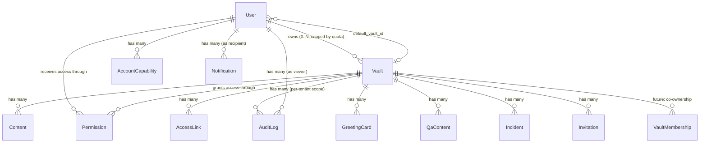

# Multi-Tenant Model (Account + Vaults)

## Principle

Bokunokoto is a **single-account, multi-tenant** system. A `User` is one authenticated person. Each person may **own zero or more `Vaults`** and, independently, may **receive access** to vaults owned by others. The vault is the tenancy boundary — every published content row, audit row, access link, greeting, Q&A, and incident belongs to exactly one vault, and authorization is decided per vault.

This replaces the earlier "one vault per user" rule. The earlier rule was a product-scope simplification, not an architectural commitment; the relational schema (`permissions`, `contents`, `audit_logs`, `access_links`) was already multi-vault-shaped. The blockers were `User has_one :vault`, the unique DB index on `vaults.user_id`, and the singular route `resource :vault`.

## Why multi-tenant matters for Bokunokoto

The Navigation Sheet use case spans audiences a single vault cannot serve well:

- A wheelchair user may want **one vault for employers** (level-gated medical context, accommodation needs, emergency contacts) and **another for friends** (LGBTQ identity, pronouns, social context) — two distinct disclosure surfaces from one account.
- A trans person may want a **public name vault** (chosen name, pronouns, public bio) and a **legal vault** (legal name, deadname kept private for paperwork only), each with different access link audiences.
- A care recipient may want **one vault for medical staff** and **one for family members**, with different L2-gate copy, different symbol palettes, and different greeting templates.

Single-tenant forces either oversharing (everything in one vault, gated by level) or sock-puppet accounts (multiple Firebase users, lost audit continuity). Multi-tenant gives the discloser editorial control over **what counts as one disclosure space** without splitting their identity.

## Prior art and what we take from each

| Product            | Tenant pattern                                       | What we take                                                                                                             | What we reject                                                                |
|--------------------|------------------------------------------------------|--------------------------------------------------------------------------------------------------------------------------|-------------------------------------------------------------------------------|
| Facebook Pages     | Account owns N Pages; Page has per-role membership   | Vault is owned by an account; client switches active vault; future role table mirrors Page Roles (Admin/Editor/Analyst). | Pages are public-default; Bokunokoto vaults are private-default with L0 gate. |
| LinkedIn Company Pages | Personal Profile + N Company Pages per account   | Idea of a default personal vault auto-creatable on first BKC entry; org/team vaults as a later tier.                     | LinkedIn's public-by-default exposure model; we keep trust-level gating.      |
| Instagram          | Account switcher (one login, multiple accounts)      | Per-vault context switcher contract in the client; persisted "last active vault" per device.                             | IG's separate account credentials; we keep a single Firebase identity.        |
| Slack / Notion     | Workspace tenant with team membership                | Per-tenant audit logs and per-tenant settings.                                                                           | Workspace-as-tenant; Bokunokoto stays user-owned, not org-owned, for v1.      |
| Discord            | Server (guild) tenant with role hierarchy            | Idea of per-tenant role hierarchy as a future extension.                                                                 | Discord's invite-link explosion; we keep AccessLink scarce and per-vault.     |
| Twitter / X        | One account, no tenants                              | Nothing — too flat for the disclosure use case.                                                                          | Single-tenant simplification.                                                 |

The shape we land on is closest to **Facebook Pages + Instagram account switcher**: one Firebase identity, multiple owned vaults, a UI switcher that selects the active vault, and per-vault authorization on every request.

## Concepts

| Concept                     | Meaning                                                                          | Where it lives                            |
|-----------------------------|----------------------------------------------------------------------------------|-------------------------------------------|
| `User`                      | Authenticated person; identity anchor; never tied to a single disclosure context | `users`                                   |
| `Vault`                     | A disclosure tenant; owned by a user; the boundary for all per-tenant data       | `vaults` (one row per owned vault)        |
| `Permission`                | Viewer ↔ vault relationship; carries trust level, context, status                | `permissions`                             |
| `VaultMembership` *(future)*| Co-owner / editor / analyst on a vault (FB Page Role analog)                     | `vault_memberships` *(not in v1)*         |
| `ActiveVaultContext`        | Runtime selection: which owned or received vault the client is currently viewing | Client state + `X-BK-Active-Vault` header |
| `AccountCapability`         | What the account can do (create vault, create N vaults, BKC, beta)               | `account_capabilities`                    |

`User.role` remains a **platform/operator** field (operator, admin) only. Whether someone is a publisher or viewer is derived from `Vault.user_id` and `Permission.user_id` against the current request's target vault — never from a global field on the user.

## Ownership rules

1. **Many owned vaults per user.** `User has_many :owned_vaults, class_name: "Vault", foreign_key: :user_id`. The DB-level unique index on `vaults.user_id` is dropped; replaced by a non-unique index for owner lookups.
2. **Per-account vault cap.** Default cap is **3 vaults per account** in v1 (tuned by `AccountCapability.vault_quota`, default 3, beta testers 10, operators unlimited). The cap exists to prevent abuse, not to limit users with legitimate need — operators can lift it on request, and billing tiers can lift it automatically. Quota is checked at vault creation time, not at access time.
3. **Sole ownership in v1.** Each vault has exactly one owner. Co-ownership (`VaultMembership`) is reserved for a later business tier; the schema leaves room (`vault_memberships` table specced, not built) but the v1 API enforces single owner.
4. **Cascade rules.** Deleting a user destroys all vaults they own (which cascade to their contents, links, logs, etc.). A vault delete is **soft** by default (`vaults.archived_at`) so audit history remains queryable to the owner — hard delete is a separate operator-only action.
5. **Default vault.** A user may optionally have a `default_vault_id` on `users` that points at one of their owned vaults; the client uses it to seed the context switcher. Removing/archiving the default unsets the pointer.

## Data model changes

### Changes to existing tables

| Table         | Change                                                                                                       | Migration risk                                  |
|---------------|--------------------------------------------------------------------------------------------------------------|-------------------------------------------------|
| `vaults`      | Drop unique index on `user_id`; add non-unique index; add `archived_at`, `slug` (unique per owner), `kind`   | Low — drop+add index, no data loss              |
| `users`       | Add `default_vault_id` (nullable FK → vaults)                                                                | Low — nullable add                              |
| `audit_logs`  | Already has `vault_id` — no change                                                                           | None                                            |
| `permissions` | Already keyed on `[vault_id, user_id]` — no change                                                           | None                                            |
| `account_capabilities` *(new or extended)* | Add `vault_quota` (int, default 3)                                                                   | Low — additive                                  |

### New tables

| Table                 | Purpose                                                                                  | Status                                    |
|-----------------------|------------------------------------------------------------------------------------------|-------------------------------------------|
| `vault_memberships`   | Future co-ownership (Admin/Editor/Analyst per vault), FB Page Roles analog               | Specced only — not created in v1          |

### Field naming

`vault.user_id` is renamed in **code** (associations) to `owner_user_id` semantics via `belongs_to :owner, class_name: "User", foreign_key: :user_id`. The column stays `user_id` to avoid a destructive rename migration — the model exposes both `vault.owner` and the existing `vault.user`. New code should call `vault.owner`.

## Authorization rules

Every request that touches a vault must resolve a **vault context** and then check the actor's relationship to that vault. The resolver:

1. Read `vault_id` from the route (`/api/v1/vaults/:vault_id/...`) **or** from the `X-BK-Active-Vault` header (for `/api/v1/my/*` endpoints), in that order.
2. If neither is set, fall back to `current_user.default_vault_id`. If that is also null, return `409 Conflict` with `error: "active_vault_required"` and the list of owned vaults in the body. The client uses the response to prompt the user to pick a vault or create one.
3. Confirm the resolved vault is either owned by `current_user` (for `/my/*` and `/bkc/*`) or that `current_user` has an active `Permission` row (for viewer routes).
4. Compute trust level via `current_user.trust_level_for(vault)` and pass it down to the level filter.

| Action                                  | Required relationship                                                                                       |
|-----------------------------------------|-------------------------------------------------------------------------------------------------------------|
| Create new vault                        | `account.vault_quota` remaining ≥ 1                                                                         |
| View/edit any vault content             | `vault.owner_user_id == current_user.id`                                                                    |
| Switch active vault to one I own        | `vault.owner_user_id == current_user.id`                                                                    |
| Switch active vault to one I view       | `Permission.where(vault:, user: current_user, status: "active").exists?`                                    |
| View protected content in another vault | Active permission **and** required level/security gates pass                                                |
| Update viewer trust level on a vault    | `vault.owner_user_id == current_user.id`                                                                    |
| Operator override                       | `current_user.platform_operator?` and request carries a logged override token (auditable, time-boxed)       |

## API surface

The contract is **vault-scoped by default**. There is no global "my data" concept anymore — there is "my data **in this vault**".

### Read endpoints

| Endpoint                                          | Purpose                                                                                       |
|---------------------------------------------------|-----------------------------------------------------------------------------------------------|
| `GET /api/v1/account/context`                     | Current user, capabilities, **owned vault list**, **received vault list**, default vault id   |
| `GET /api/v1/my/vaults`                           | Owned vaults (replaces singular `GET /api/v1/my/vault`)                                       |
| `GET /api/v1/my/vaults/:id`                       | Owner-facing detail for one owned vault                                                       |
| `GET /api/v1/vaults/:vault_id/contents`           | Viewer/owner content list, filtered by viewer trust level                                     |
| `GET /api/v1/vaults/:vault_id/audit_logs`         | Owner-only audit log for one vault (replaces `/my/audit_logs`)                                |
| `GET /api/v1/vaults/:vault_id/analytics/*`        | Owner-only analytics, scoped to one vault (replaces `/my/analytics/*`)                        |

### Write endpoints

| Endpoint                                              | Purpose                                                                                |
|-------------------------------------------------------|----------------------------------------------------------------------------------------|
| `POST /api/v1/my/vaults`                              | Create a new owned vault if quota allows                                               |
| `PATCH /api/v1/my/vaults/:id`                         | Update an owned vault                                                                  |
| `POST /api/v1/my/vaults/:id/archive`                  | Soft-archive an owned vault                                                            |
| `POST /api/v1/my/vaults/:id/restore`                  | Restore an archived vault                                                              |
| `PATCH /api/v1/my/default_vault`                      | Set or change the user's default active vault                                          |
| `POST /api/v1/my/vaults/:id/contents`                 | Create content in an owned vault                                                       |
| `PATCH /api/v1/my/vaults/:id/contents/:content_id`    | Update content                                                                         |
| `POST /api/v1/handshake`                              | Unchanged — handshake resolves the target vault from the access link, not the actor   |

### Headers

| Header                | Sent by    | Meaning                                                                                                  |
|-----------------------|------------|----------------------------------------------------------------------------------------------------------|
| `X-BK-Platform`       | Client     | `web` (capped at L4), `ios`, `android` (full range allowed)                                              |
| `X-BK-Active-Vault`   | Client     | UUID/slug of the vault the user has selected as the active context; preferred over `default_vault_id`   |
| `X-BK-Time-Anchor`    | Client     | NTP anchor; unchanged                                                                                    |

### Deprecation

These endpoints exist today and are kept as **deprecated aliases** for one release cycle to keep the Flutter client and CI green:

- `GET /api/v1/my/vault` → returns the default vault, with `Deprecation: true` header
- `POST /api/v1/my/vault` → creates the first vault for users with zero vaults; `409` thereafter with the multi-vault hint

## Client context switching

See `context-switching.md` for the full client design. The contract:

- Client fetches `GET /api/v1/account/context` on launch and on every "switch account" gesture.
- Client persists `active_vault_id` per device in secure storage; on launch it tries that, then `default_vault_id`, then prompts the user.
- Every API request includes `X-BK-Active-Vault` unless the route already carries `:vault_id`.
- Switcher UI lives in the top app bar (mobile) or the left rail (web). It lists owned vaults grouped first ("Your vaults") then received vaults ("Shared with you"). Long-press → "Set as default".

## Platform restrictions preserved

The L0–L4 web cap, ABC Shield, burn-after-reading, secure audio, camera/GPS gates, and audit immutability all apply **per vault**. None of them are affected by the multi-tenant change — they are evaluated against the resolved active vault and the viewer's trust level for that specific vault.

## Migration sequence (data side)

1. Add `default_vault_id` to `users` (nullable).
2. Backfill `users.default_vault_id` from each user's existing single vault (where present).
3. Drop the unique index on `vaults.user_id`; add a non-unique replacement.
4. Add `vaults.archived_at`, `vaults.slug`, `vaults.kind`.
5. Backfill `vaults.slug` from `display_name` (uniqueness scoped to owner).
6. Add `account_capabilities.vault_quota` with default 3.
7. Mark legacy `GET/POST /api/v1/my/vault` deprecated; ship plural endpoints alongside.
8. Roll the Flutter client to consume the plural API; remove deprecated routes one release later.

## Out of scope for v1

These are reserved for a later phase to keep the v1 multi-tenant rollout small:

- Co-ownership (`VaultMembership`) — schema specced, not built.
- Vault-level billing (paid vault tiers, sponsored vaults).
- Vault transfer between accounts.
- Vault templates / cloning.
- Org-tenancy (Slack-style workspace above the vault).

## Acceptance criteria

- A user can create up to `account.vault_quota` vaults from the BKC.
- A user with two owned vaults can switch the active context and the BKC reflects only that vault's contents, links, viewers, and audit logs.
- A viewer with permissions on two vaults sees both in their context switcher and can move between them without re-authenticating.
- A request to `/api/v1/my/*` without `X-BK-Active-Vault` and without a `default_vault_id` returns `409 active_vault_required` with the owned vault list.
- All audit log writes record `vault_id`; no audit row can be created without one.
- Web platform requests resolve trust level **per active vault** before the L4 cap is applied.
