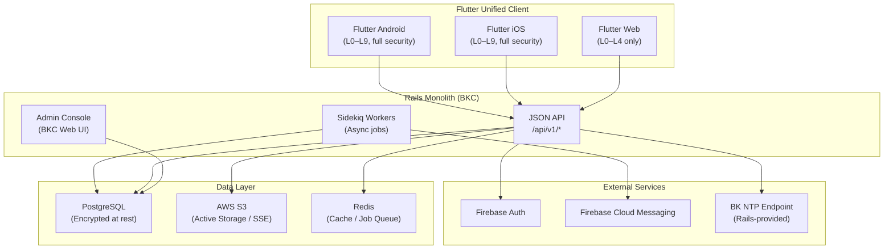

# System Overview

## High-Level Architecture

Bokunokoto adopts a **Rails monolith + Flutter unified client** architecture, optimized for low development cost, security, and maintainability.



## Deployment Model

BK operates as a **rental-base SaaS** (multi-tenant monolith). A single Rails application serves many personal vaults. A registered user can own a vault as a discloser and can also receive access to other users' vaults from the same account.

| Component | Hosting | Notes |
|---|---|---|
| Rails API + BKC | Heroku / Render | Monolith deployment with Sidekiq |
| PostgreSQL | Heroku Postgres / RDS | Active Record Encryption enabled |
| Object Storage | AWS S3 | Face snapshots, greeting card assets |
| Flutter Web | Firebase Hosting | Low-permission client (L0–L4) |
| Flutter App | Firebase App Distribution (Beta) → App Store / Google Play (Release) | Full-permission client (L0–L9) |

## Multi-Tenant Isolation

Every disclosure record is scoped to a **Vault**. Initial product scope is one active vault per user, but the account model treats vault ownership as a relationship instead of a permanent user role. Rails controllers enforce vault-level scoping through ownership and permission checks, preventing cross-tenant data leakage.

```ruby
# Owner queries go through the user's owned vault.
@contents = current_user.owned_vault.contents

# Viewer queries go through the target vault and the viewer relationship.
@contents = target_vault.contents.accessible_for(current_user, platform)
```

## Context-Aware Client

The Flutter app may present admin and viewer experiences as modes, but these are **runtime contexts**, not permanent account roles:

| Context | Source of truth | Capabilities |
|---|---|---|
| **Own Vault** | Current user owns the selected vault and has BKC capability | Edit content, issue QR codes, monitor audit logs, send greetings |
| **Received Vault** | Current user has a permission relationship with another vault | Browse permitted content, submit questions, receive notifications |
| **Operator** | Platform-level operator grant | Support, compliance, abuse response, and system administration |

See [Account & Role Model](account-role-model.md) for the canonical account model.

## Feature Flags

New features (NFC, eKYC, etc.) are gated behind Feature Flags managed in the Rails backend. This allows staged rollout, A/B testing, and emergency kill-switches without app updates.

```ruby
class User < ApplicationRecord
  def feature_enabled?(feature_name)
    FeatureFlags.enabled?(feature_name, self)
  end
end
```
