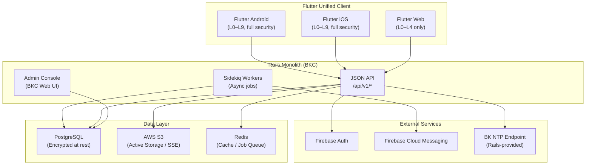

# System Overview

## High-Level Architecture

Bokunokoto adopts a **Rails monolith + Flutter unified client** architecture, optimized for low development cost, security, and maintainability.



## Deployment Model

BK operates as a **rental-base SaaS** (multi-tenant monolith). A single Rails application serves many personal vaults. A registered user can own a vault as a discloser and can also receive access to other users' vaults from the same account.

| Component | Hosting | Notes |
|---|---|---|
| Rails API + BKC | Heroku / Render | Monolith deployment with Sidekiq |
| PostgreSQL | Heroku Postgres / RDS | Active Record Encryption enabled |
| Object Storage | AWS S3 | Face snapshots, greeting card assets |
| Flutter Web | Firebase Hosting | Low-permission client (L0–L4) |
| Flutter App | Firebase App Distribution (Beta) → App Store / Google Play (Release) | Full-permission client (L0–L9) |

## Multi-Tenant Isolation

Every disclosure record is scoped to a **Vault**. A user can own **multiple vaults** (capped by `AccountCapability.vault_quota`, default 3) and can independently receive access to other users' vaults from the same account. Each vault is a tenancy boundary: its own contents, viewers, links, audit logs, greetings, Q&A, and incidents.

The active vault for any given request is resolved from (in order): the `:vault_id` route param, the `X-BK-Active-Vault` header, then `users.default_vault_id`. If none resolve and the route is owner-scoped, the API returns `409 active_vault_required` with the user's owned-vault list so the client can prompt the switcher.

```ruby
# Owner queries go through the resolved active vault (validated against current_user).
@contents = current_vault.contents

# Viewer queries go through the target vault and the viewer relationship.
@contents = target_vault.contents.accessible_for(current_user, platform)
```

See [Multi-Tenant Model](multi-tenant-model.md), [Context Switching](context-switching.md), and [Comparative Analysis](comparative-analysis.md).

## Context-Aware Client

The Flutter app presents a **per-vault context switcher** (Instagram-style) — one Firebase identity, multiple vaults, no mode toggle. The active vault is persisted per device and sent on every request:

| Context | Source of truth | Capabilities |
|---|---|---|
| **Own Vault (active)** | `current_user` owns the resolved active vault, has BKC capability | Edit content, issue QR codes, monitor audit logs, send greetings, manage viewers |
| **Received Vault (active)** | `current_user` has an active permission relationship with the resolved vault | Browse permitted content, submit questions, receive notifications |
| **Operator** | Platform-level operator grant with an explicit override token | Support, compliance, abuse response, and system administration |

See [Account & Role Model](account-role-model.md) for the canonical account model.

## Feature Flags

New features (NFC, eKYC, etc.) are gated behind Feature Flags managed in the Rails backend. This allows staged rollout, A/B testing, and emergency kill-switches without app updates.

```ruby
class User < ApplicationRecord
  def feature_enabled?(feature_name)
    FeatureFlags.enabled?(feature_name, self)
  end
end
```
