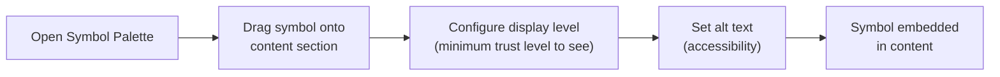
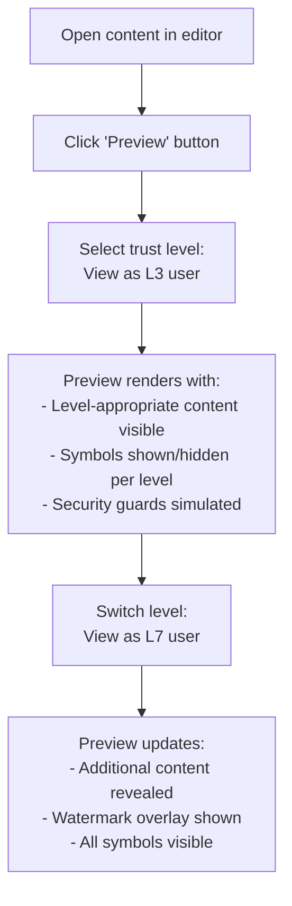

# Content Editor

## Overview

The BK Content Editor is a hybrid authoring tool that supports Markdown, HTML, and drag-and-drop builder mode. It is the primary interface for vault owners to create and manage the content that lives behind each trust level.

---

## Editing Modes

| Mode | Engine | Best For |
|---|---|---|
| **Markdown** | Extended Markdown parser with live preview | Quick text content, structured documents |
| **HTML** | Action Text (Trix) or TipTap rich text editor | Formatted content with embedded media |
| **Drag-and-Drop** | Block-based visual builder | Visual layouts without writing code |

### Engine Options

BK supports two rich text editor backends:

- **Action Text (Trix)** — Rails-native, extended with Markdown input support. Tight integration with Active Storage for file attachments.
- **TipTap** — Headless, extensible editor built on ProseMirror. Used when advanced formatting or custom node types are needed.

!!! info "Mode Switching"
    Content can be authored in any mode and the format is preserved in the database. Switching modes mid-edit is supported with a conversion step (e.g., Markdown to HTML), but switching back may lose some formatting.

---

## Symbol Palette

The Symbol Palette is a drag-and-drop panel that lets vault owners embed BK symbols directly into content sections.

### Available Symbols

| Symbol | Icon | Meaning |
|---|---|---|
| **Help Mark** | :material-help-circle: | Signals need for assistance or accommodations |
| **Rainbow Symbol** | :material-rainbow: | LGBTQ+ identity expression |
| **Ear Mark** | :material-ear-hearing: | Hearing-related accommodation needs |
| **Sign Language Mark** | :material-hand-wave: | Sign language user |
| **Maternity Mark** | :material-baby-carriage: | Expecting or new parent |
| **Custom Symbol** | :material-plus-circle: | User-defined symbols |

### Embedding Flow

Symbols are stored as structured nodes within the content body and rendered conditionally based on the viewer's trust level.

---

## Security Toggles

Each content piece has a dedicated **Security Toggles** panel with the following options:

| Toggle | Description | Effect |
|---|---|---|
| :material-content-copy: **Copy Prevention** | Blocks text selection and clipboard copy | JavaScript and native copy APIs disabled for this content |
| :material-shield-lock: **ABC Shield (Blackout)** | Activates the blackout overlay system | Content is obscured unless viewing conditions are met |
| :material-fire: **Burn-After-Reading** | Content self-destructs after first view | One-time access; content is permanently deleted after viewing |
| :material-camera: **Camera/GPS Required** | Forces environmental verification | Viewer must grant camera and GPS access before content loads |
| :material-headphones: **Earphone-Only TTS** | Restricts screen reader output | TTS semantic labels only provided when earphones are connected |

!!! warning "Combining Toggles"
    Multiple security toggles can be combined. For example, L7 content might have ABC Shield + Camera/GPS Required + Earphone-Only TTS all enabled simultaneously.

---

## Preview Simulator

The preview simulator lets vault owners see exactly how their content appears to viewers at different trust levels.

### Usage

### Preview Options

| Option | Description |
|---|---|
| **View as L0-L9** | Simulates the content view at each trust level |
| **View as specific user** | Select a user from the directory to preview their exact view |
| **Device simulation** | Preview on mobile, tablet, or desktop viewport |
| **Accessibility preview** | Simulates screen reader output, high contrast mode |

!!! tip "Catch Mistakes Before They Happen"
    Always use the preview simulator before publishing sensitive content. It helps verify that the right information is visible at the right trust levels and that security guards are configured correctly.

---

## Template Library

BK ships with pre-built content templates for common disclosure scenarios:

| Template | Description | Default Level |
|---|---|---|
| **One-Time Disclosure** | Single-use content with burn-after-reading enabled | L7 |
| **Bank Account Info** | Structured template for sharing financial details | L8 |
| **Greeting Card** | Personalizable card with variable injection | L2+ |
| **Professional Portfolio** | Work history and skills showcase | L3 |
| **Medical Information** | Structured medical data with emergency contacts | L8 |
| **Coming-Out Statement** | Guided template for identity disclosure | L6+ |

### Template Features

- **Customizable:** All templates can be modified before use
- **Saveable:** Modified templates can be saved as personal presets
- **Security presets:** Each template comes with recommended security toggles pre-configured
- **Symbol suggestions:** Templates suggest relevant symbols (e.g., Help Mark for medical templates)

---

## Content Storage

### Database Schema

| Field | Type | Description |
|---|---|---|
| `id` | `uuid` | Primary key |
| `vault_id` | `uuid` | Foreign key to the vault |
| `title` | `string` | Content title (encrypted at rest) |
| `format` | `enum` | `markdown`, `html` |
| `body` | `text` | Content body (encrypted at rest, AES-256-GCM) |
| `trust_level` | `integer` | Minimum trust level required to view (0-9) |
| `security_flags` | `jsonb` | Security toggle states |
| `audio_protection_required` | `boolean` | Earphone-only TTS flag |
| `created_at` | `datetime` | Creation timestamp |
| `updated_at` | `datetime` | Last modification timestamp |

!!! danger "Encryption"
    The `title` and `body` fields are encrypted at rest using Rails encrypted attributes (`encrypts :body, deterministic: false`). The encryption key is derived from the vault owner's master key.

---

## Mobile Editor

The Flutter own-vault context includes a simplified content editor for quick edits on the go.

### Mobile vs. Web Editor

| Feature | Web BKC Editor | Mobile Editor |
|---|---|---|
| Markdown editing | :material-check: Full | :material-check: Full |
| HTML editing | :material-check: Full | :material-close: Not available |
| Drag-and-drop builder | :material-check: Full | :material-close: Not available |
| Symbol Palette | :material-check: Drag-and-drop | :material-check: Tap-to-insert |
| Security toggles | :material-check: Full panel | :material-check: Toggle list |
| Preview simulator | :material-check: Multi-level | :material-check: Current level only |
| Template library | :material-check: Full browse | :material-check: Favorites only |

!!! info "Sync"
    Edits made in the mobile editor are synced to the server immediately. Opening the same content in the web BKC will show the latest version without conflict — BK uses last-write-wins with edit history for recovery.
