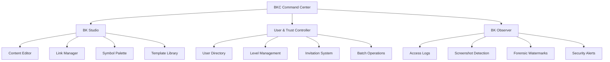
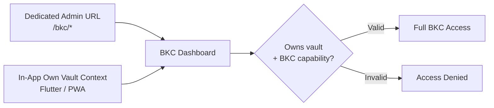

# BKC Command Center Overview

## Overview

**BKC** (Bokunokoto Command Center) is the admin backbone of the BK platform. Every registered user can manage **one or more personal vaults** from the same account they use to receive other people's disclosures. BKC scopes every screen to the **currently active vault** — the user picks which of their owned vaults they're working in via the context switcher (top-right dropdown on web, app bar on mobile own-vault context). Switching vaults is instant; the dashboard, content list, viewer directory, audit logs, and analytics all re-scope on switch.

See [Multi-Tenant Model](../architecture/multi-tenant-model.md) and [Context Switching](../architecture/context-switching.md) for the underlying contract.

---

## Tech Stack

| Layer | Technology | Notes |
|---|---|---|
| **Backend** | Ruby on Rails | API and admin server |
| **Frontend** | Hotwire (Turbo + Stimulus) | SPA-like experience without heavy JS frameworks |
| **Components** | ViewComponent | Reusable, testable UI components |
| **Real-time** | Turbo Streams + ActionCable | Live updates for audit logs, notifications |
| **Mobile Own Vault** | Flutter own-vault context | On-the-go management mirroring BKC functionality |

!!! info "Why Hotwire?"
    BKC prioritizes server-rendered HTML with progressive enhancement. Hotwire provides fast, interactive admin UIs without the complexity of a separate SPA frontend. ViewComponent keeps the admin UI modular and testable.

---

## Three Main Sections



### 1. BK Studio

The content and link management hub:

- **Content Editor** — Create and edit vault content in Markdown, HTML, or drag-and-drop mode (see [Content Editor](content-editor.md))
- **Link Manager** — Generate and manage dynamic access links and QR codes
- **Symbol Palette** — Configure which symbols (Help Mark, Rainbow, Ear Mark, etc.) are active and at which trust levels
- **Template Library** — Pre-built and custom templates for common disclosure scenarios

### 2. User & Trust Controller

Viewer and permission management for the **currently active vault**. Each owned vault has its own viewer directory; switching vaults switches the directory.

- **User Directory** — Browse all users who have accessed *this* vault
- **Level Management** — Adjust trust levels (L0–L9) per user with one action
- **Invitation System** — Create and send email invitations with preset access levels
- **Batch Operations** — Select multiple users for bulk level changes
- **Cross-vault hint** — If the same viewer also has permission on another vault you own, BKC shows a non-blocking badge ("Also in: *Personal*") so you can navigate without losing context

See [User & Trust Controller](user-trust-controller.md) for full details.

### 3. BK Observer

Forensic monitoring and security intelligence:

- **Access Logs** — Complete audit trail of every content view, with timestamps, device info, and location
- **Screenshot Detection** — Alerts when screenshot attempts are detected on native apps
- **Forensic Watermarks** — Track leaked content back to the viewer who captured it
- **Security Alerts** — Real-time notifications for suspicious activity (GPS spoofing, repeated auth failures)

---

## Additional Modules

### Greeting Center

Manage greeting cards, batch imports, time-locked delivery, and delivery tracking. See [Greeting Engine](../features/greeting-engine.md).

### Feature Flag Management

Control feature rollouts and A/B tests:

- Toggle features per user, per trust level, or globally
- Schedule feature activation/deactivation
- Monitor feature adoption metrics

### Analytics Dashboard

Track engagement, security events, and trust progression. See [Analytics Dashboard](analytics.md).

---

## Mobile Own Vault: Flutter Context

The BK Flutter app includes an **Own Vault context** that mirrors BKC functionality for on-the-go management.

| Feature | Web BKC | Mobile Own Vault |
|---|---|---|
| Content editing | Full editor (Markdown/HTML/Builder) | Simplified editor for quick edits |
| User management | Complete directory and controls | Quick level-up via QR scan |
| Analytics | Full dashboard with charts | Summary cards and key metrics |
| Audit logs | Full searchable log | Recent activity feed |
| Greeting management | Full builder and scheduler | Quick send and status check |

!!! tip "QR-to-Profile Shortcut"
    In the mobile own-vault context, scanning a viewer's QR code immediately opens their profile with a quick level-up button — useful for in-person trust upgrades at events or meetings.

---

## Security

### Authentication Requirements

| Action | Minimum Requirement |
|---|---|
| View BKC dashboard | Owns target vault + BKC capability |
| Edit content | L9 + active session |
| Change trust levels | L9 + FIDO2 or 2FA confirmation |
| View audit logs | L9 + FIDO2 or 2FA confirmation |
| Delete content | L9 + FIDO2 re-authentication |

### Ownership and Capabilities

BKC access is enforced per active vault from database relationships:

```ruby
current_user.owns?(current_vault) && current_user.capability_enabled?("bkc_access")
```

`current_vault` is resolved from the `X-BK-Active-Vault` header (or `users.default_vault_id`) and validated against `current_user.owned_vaults`. Firebase custom claims may still identify platform operators, but vault ownership must be checked against the `Vault` and `AccountCapability` records.

!!! danger "Single-owner per vault (v1)"
    Each vault has exactly one owner in v1. A `VaultMembership` table is specced for future co-ownership (FB Page Roles analog: Admin/Editor/Analyst) but is not built in v1. Users who need parallel surfaces should create multiple vaults instead — they can switch between them with the context switcher.

---

## Dual Entry Points

Users can access BKC through two paths:



1. **Dedicated admin routes** — Direct URL access at `/bkc/*` paths (web browser)
2. **In-app own-vault context** — Switch between received-vault browsing and own-vault management within the Flutter app or PWA

Both entry points share the same authentication and authorization pipeline.
