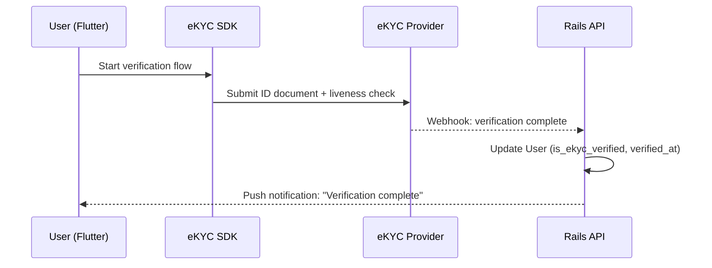

# Release Phase (Month 12+)

## Paid Launch

At the 12-month mark, BK transitions from free beta to a **capability-based subscription model**. A user keeps one account and can unlock vault-owner capabilities, receiver capabilities, or both.

### Subscription Plans

#### Vault Owner Capability

For users who create and manage their own vault. This is a capability attached to the user's account, not a separate discloser account.

| Feature | Free (Beta Legacy) | Paid |
|---|---|---|
| Vault creation | 1 vault | 1 vault |
| Content levels | L0–L4 | L0–L9 |
| Access links | 3 | Unlimited |
| Greeting cards | 5/month | Unlimited |
| Excel batch import | — | :material-check: |
| BKC full analytics | — | :material-check: |
| Custom symbols | — | :material-check: |
| NTP time-lock delivery | — | :material-check: |
| Priority support | — | :material-check: |

#### Receiver Capability

For users who view other people's vaults. This is a capability attached to the same account that may also own a vault.

| Feature | Free | Paid |
|---|---|---|
| L0–L4 content | :material-check: | :material-check: |
| L5–L9 content (app only) | — | :material-check: |
| Secure audio (earphone TTS) | — | :material-check: |
| Digital card case (bookmark vaults) | 3 vaults | Unlimited |
| Greeting card reception | — | :material-check: |
| Priority support | — | :material-check: |

### Payment Integration

- **Provider:** Stripe (via `stripe` gem for Rails)
- **Model:** Monthly/annual subscription with account capabilities
- **Rails Implementation:** `Subscription` model with `user_id`, `capability`, `status`, `expires_at`
- **Feature Flag Integration:** Subscription status grants or restricts account capabilities at the API level

```ruby
def show
  content = Content.find(params[:id])
  unless current_user.capability_enabled?("receiver_l5_plus") && current_user.can_view?(content)
    render_security_error and return
  end
  render json: content
end
```

## eKYC Integration

Launched simultaneously with billing, eKYC adds government-ID-level identity verification.

### Purpose

- Replace OpenCV face detection with authoritative identity verification
- Enable vault owners to require eKYC for L4+ access
- Display "Verified" badge on eKYC-completed user profiles

### Provider Options

| Provider | Coverage | Notes |
|---|---|---|
| TRUSTDOCK | Japan | My Number Card, driver's license |
| Liquid | Japan | Banking-grade KYC |
| Onfido | Global | Passport, ID card, liveness |

### Technical Integration



### Data Handling

- eKYC data (ID images, personal info) stored in a **separate encrypted table** with restricted access
- ID images are **deleted** after verification period (as required by law)
- Only the verification result (`is_ekyc_verified: true/false`) is retained long-term
- Rails `WebhooksController` receives provider callbacks

## Business Version (Future)

A future enterprise tier for organizations:

| Feature | Personal | Business |
|---|---|---|
| Users per account | 1 | Team-based |
| SSO integration | — | SAML / OIDC |
| Organization management | — | :material-check: |
| Compliance audit export | — | CSV/PDF export |
| Custom branding | — | :material-check: |
| SLA | — | 99.9% uptime |
| Dedicated support | — | :material-check: |

### Use Cases

- **HR departments:** Employee accommodation disclosure management
- **Healthcare:** Patient-to-provider sensitive information sharing
- **Legal:** Confidential client information management
- **Education:** Student support services

!!! note "Business version is a future consideration"
    The business version is not part of the current development scope. The personal platform must be proven and refined through the beta and initial paid phases first.
